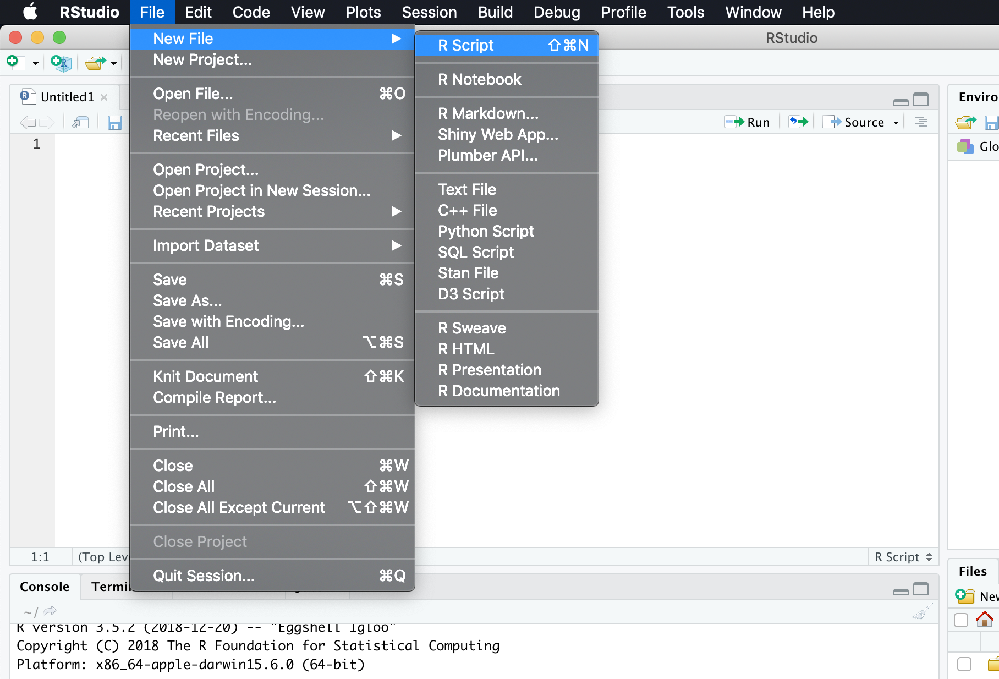
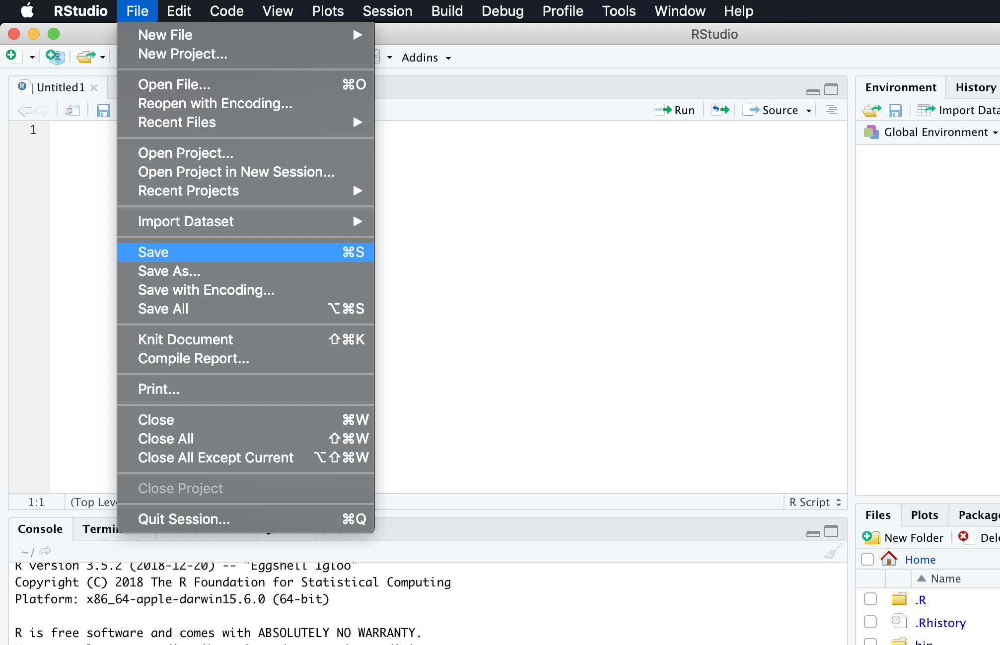
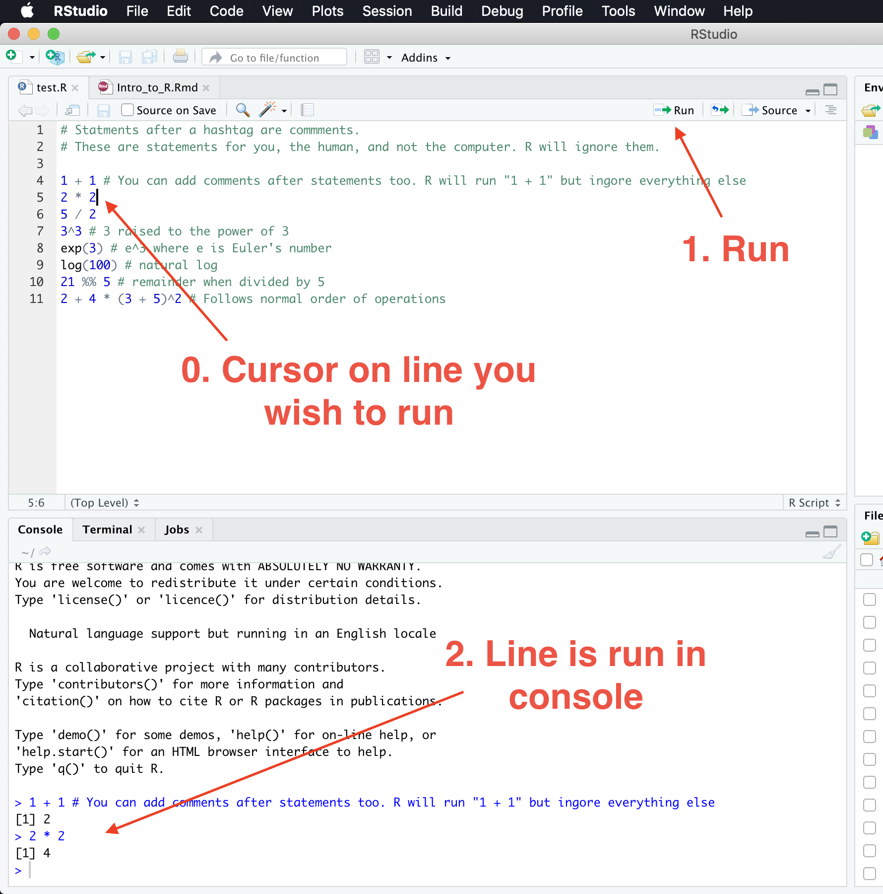
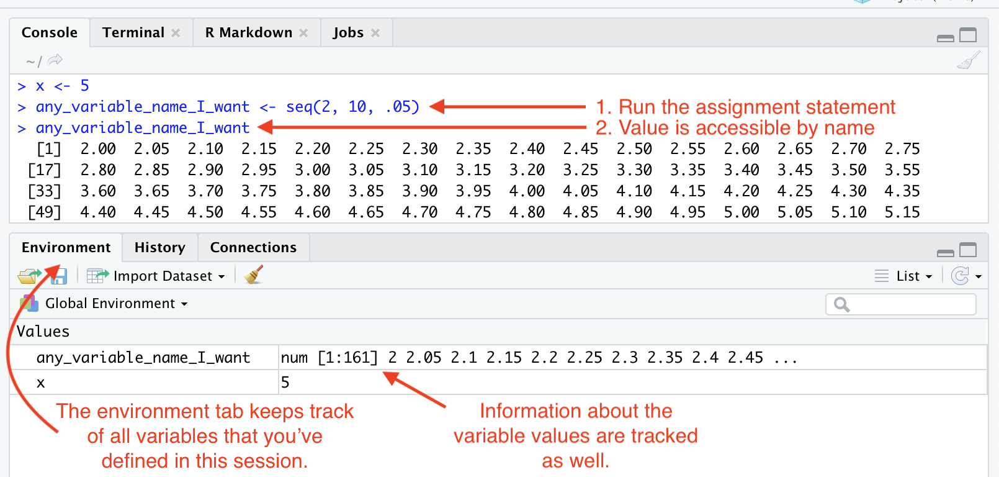
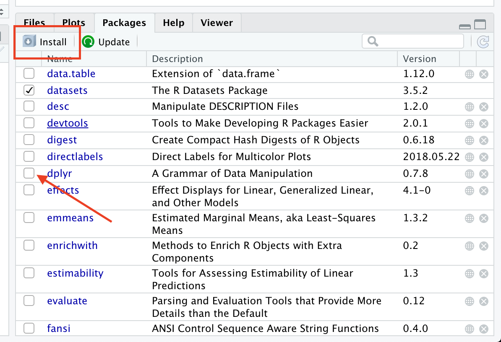

\newcommand{\expect}[1]{\mathbf{E}\left[ #1 \right]}
\newcommand{\variance}[1]{\mathrm{Var}\left( #1 \right)}
\newcommand{\covariance}[1]{\mathrm{Cov}\left( #1 \right)}

```{r setup, include=FALSE}
knitr::opts_chunk$set(echo = TRUE, cache=TRUE, eval=FALSE)
```

# Overview

This guide is meant to help beginners in R. If you have little programming experience, are in the midst of taking your first statistics class, I have you in mind as I write this guide.

These guides are incredibly difficult to write, because the person on the other end of this guide may come to the table with varying amounts of experience. Perhaps you've never dealt ANY programming before, some of you may be familiar with how functions work, or what an "argument" is. Others may not remember their order of operations. And that's *okay*, just know that sometimes this guide might feel a bit slow, and sometimes a bit fast.

What I can promise, is that I will be a little more explicit about the systematic components of R such as the data types. In addition, I'll link out to more detailed sources liberally, so no matter what level you're coming from, either this guide or the external links will have your answer. This will be particularly helpful if you're coming to R from a different programming language, because you are more familiar with the terminology, like "strings" or "file paths".

There have been many iterations of guides like these, written at similar levels. It would be irresponsible for me not to mention them or even claim that this guide is better than those previously written. My personal favorite is

* [Roger Peng's R programming for Data Science](https://bookdown.org/rdpeng/rprogdatascience/)
  - If this book is helpful to you, or you would like to have the R code/datasets while reading along, please consider paying for his work through [Leanpub](https://leanpub.com/rprogramming). It's pay what you want.

# Installation

Starting out, you will likely want to download Rstudio and R. These are different. Roughly speaking, R is the language itself, and Rstudio is the (very nice) environment that you'll use to interact with the language.

[R Language](https://www.r-project.org/) - After finding the "download link" you'll be asked to pick a *CRAN Mirror*. Just pick the server that is geographically close to you. These are just copies of the software that are hosted worldwide. The software will download faster if you're closer to the server (generally).

[R Studio](https://www.rstudio.com/products/rstudio/download/#download) - Pick the right operating system and off you go!


### Orientation in RStudio


Here's a picture of the layout that you'll see. There are "panes", and a number of windows that you should be familiar with first. Note that in each "pane" there are some tabs that can change the content of the pane.

1. Source Editor - This is the place you'll be writing "scripts". If you're writing code that you will want to save into a file, this is where you would do that. You can think of this as just a text file, with a special extension ".R" so that your computer knows that the text that is contained in the file is actually R code.
2. Console - If you want to actually RUN R code, this is where you'll enter it. The `>` is important. The greater than symbol means that R is "ready for a new command". If you don't see this (a `+` or something), hit `Esc` until you see it again. Note that things you enter directly in the console *will not be saved*. We normally would use this for one-off calculations, or looking at parts of our code *interactively*.
3. Environment - This area will have all the variables that we've saved, that R knows about. When we learn about assignment later, you will see them show up here. This provides information about the name and the type of variable it is.
4. Files/Plots/Help/etc - This area is important because you can navigate your computer files here. You can also see a list of "packages" that R has loaded. Finally, if you make any plots, or ask R for help, they will appear in this pane.

Here's the workflow I would recommend to get started. 

1. Open up a new script in `File > New File > R Script`.
2. Save the empty file somewhere you on your computer that is appropriate.
3. Type all your code in the source editor, then use the "Run" button to transfer that line down into the console.
4. Examine the console for the result of running that R code
5. Save often!







# Basics

Throughout this guide, it will be useful to play with things on your own to truly understand how to use these tools. You can only learn so much of this by reading. I try to be helpful by also "commenting" the code", which can be done in R with `#`.

```{r}
# Statments after a hashtag are commments.
# These are statements for you, the human, and not the computer. R will ignore them.
```

That said, R has internal "help" files for everything in the language, which provide both a description of the function, a breakdown of the topic, and some examples. These can be accessed by prepending things with a `?`. You will see statements like these littered throughout the document below. Just know that these are for when you just want a little more information about how a particular operation or function works.

And when that doesn't help, Google furiously! [Stack Overflow](https://stackoverflow.com/questions/tagged/r) has a very friendly community to ask questions if you get stuck. Chances are someone has run into the problem you've run into already, and someone will have an answer for you online.

## Calculator in R

The basic mathematical operations in R will behave as you expect. I won't show the output of everything I type, I just hope you'll copy and paste things into the console of things you're not sure about to confirm them for yourself.

```{r eval=FALSE}

1 + 1 # You can add comments after statements too. R will run "1 + 1" but ingore everything else
2 * 2
5 / 2
3^3 # 3 raised to the power of 3
exp(3) # e^3 where e is Euler's number
log(100) # natural log
21 %% 5 # remainder when divided by 5
2 + 4 * (3 + 5)^2 # Follows normal order of operations
```

## Logical (True and False)

True and False can be specified as:

* `TRUE` or `T`
* `FALSE` or `F`

These come with what are called "boolean operators", essentially mathematical operations on logical values. TRUE and FALSE are also known as boolean values. For example:

* `&` - logical "and"
* `|` - logical "or" (this is a vertical bar, or pipe, normally found above the backslash character `\`)
* `!` - logical "not"
* `xor()` - logical "exclusive or"

Each of these correspond pretty well to what they mean in the english language. Imagine I say:

"I'm either a statistician OR a circus performer." 

At least one of those would need to be true in order for that statement to be factual. Hence all of `T | T`, `T | F` and `F | T` will evaluate to `TRUE`. The only way for that statement to be a lie would be for both to be false, which is why `F | F` evaluates to `FALSE`. Exclusive Or `xor()` is a special case in which instead of at least one, we require EXACTLY one to be true in order to evaluate to true. The "not" `!` statement will reverse the logical value. Here's a summary of the truth values that the basic functions will  evaluate to. 


+-----+-----+-----+---------+---------+------------+
| `x` | `y` |`!x` | `x & y` | `x | y` | `xor(x,y)` |
+=====+=====+=====+=========+=========+============+
|T    |T    |F    |T        |T        |F           |
+-----+-----+-----+---------+---------+------------+
|T    |F    |F    |F        |T        |T           |
+-----+-----+-----+---------+---------+------------+
|F    |T    |T    |F        |T        |T           |
+-----+-----+-----+---------+---------+------------+
|F    |F    |T    |F        |F        |F           |
+-----+-----+-----+---------+---------+------------+


Now we can compare numbers, and have them evaluate to logical values. Most computing languages have this so it's easier to control the flow of programs. "Run this chunk of code conditional on whether or not something is true".


```{r eval=FALSE}
!TRUE # FALSE
TRUE | FALSE # TRUE
TRUE & FALSE # FALSE
?logical
?`&`

5 > 3 # 5 is greater than 3, TRUE
2 >= 2 # 2 is indeed greater than or equal to 2, TRUE
4 != 3 # 4 is not equal to 3


is.logical(FALSE) # TRUE
is.logical(1) # FALSE
is.numeric(1) # TRUE
?is.logical
?is.numeric
```


The last three are some special functions that allow us to ask R, what type of objects are we dealing with here, and R will tell us yes or no.
This is also our first example of a *function* that we deal with. We will cover these in more depth a little later in the functions section.

## Vectors

This is how we deal with multiple values at once, in the same object. Since we often deal with multiple numbers at once, this will make it much easier to process them! R makes it very easy for us to apply some function to an entire list of numbers. For example, if we want to take the logarithm of a bunch of numbers, we can just call the function on that vector instead of each individually. 

We say that the operation is "vectorized" if the function will act on each of the elements individually.

The syntax to create a "vector" of things, is `c(2, 3, 4)`, which will combine the numbers 2, 3, and 4 into one object. The `c()` stands for "combine".


```{r}
c(1, 2, 3, 4, 5, 6, 7) # Vector of numerics
c(TRUE, FALSE, TRUE) # Vector of logicals

c(c(1, 3, 4), c(2, 3, 4)) # even combine multiple vectors into 1

log(c(1, 2, 3, 4, 5)) # log elementwise
c(1, 2, 3) + c(2, 2, 2) # Adds the numbers elementwise
c(1, 2, 3)^2 # squares each number
```

As you can see, having functions that vectorize like this can be very powerful. However, there are somethings to be careful of!

Try to keep everything of the same "type" in a vector, otherwise, the logical value will be forced into a number like the rest of the elements. R will try to be smart about how it forces these values into different types, so R will rarely show an error or warning when doing so. Generally this causes more pain than it is helpful for, so for your own sake, keep things consistent!

```{r}
c(2, 3, 4, FALSE)
```

Also, there is a "feature" in R called recycling, in which if we try to add two vectors of different lengths, R will start recyling the shorter one, that is, if it runs out, it will loop back to the first number and cycle through the vector again. Note sometimes R will throw out a warning message, but sometimes it will not (when the lengths are multiples of each other).

```{r}
?c()
c(1, 2) + c(1, 1, 1) # warning
c(1, 2) + c(1, 1, 1, 1) # No warning
```

Since creating these sequences of numbers such as integers between 2 and 100 is very common, there is a shortcut to create that instead of `c(2, 3, 4, 5, 6, 7, ...)` by using a colon syntax `2:100`. This means I want all integers between 2 and 100. 

The other way to create sequences is with the function `seq(2, 100, 1)`. The syntax of this function is `seq(FROM, TO, BY)`. From what number, to what number, and by how much in between.

```{r}
1:10 # 1-10
5:1 # Even works backwards
-6:6 # Through negative numbers too
1.5:10.9 # For decimals, it keeps them spaced by 1

seq(0, 1, .05) # Evenly spaced by .05
seq(6, 1, -1.2) # Notice the BY spacing should match the direction of the sequence
?seq()
```

## Assignment

We now learn how to save things into variable names. At the heart of it, that's really it, variable assignment is really just giving a statement a name (ideally easy for you to remember). It would not be very helpful if we ran some sort of calculation, and needed to reference that calculation later, but end up needing to run the entire caclulation again.

There are two common ways of making an assignment.

* `<-` - This is a less than sign, then and a minus sign. Notice that there is NO SPACE BETWEEN THE TWO CHARACTERS
* `=` - This is way of assigning variables in most other programming languages.

It really doesn't matter which you use. I think among those that use R, it's split about 50-50. So when looking at other people's code, it's good to know. What I *don't* recommend is *mixing them*. I prefer the `<-`, so that's what you'll see me use. For those curious, there is a keyboard shortcut to help type the assignment, it's `Option + -`.

Naming convention is to use alphanumeric names with underscores (a-zA-Z0-9). R will allow you to use a `.` as well, but I would recommend against this, since names with `.` are commonly used with the S3 method system. Plus, it's confusing because `.` is normally a special character in most other languages. If you want to name something with multiple words, either use camelCase or snake_variable_naming. Capitalization matters

```{r eval = FALSE}
a <- 3
b <- 4
A <- 1 # Capitalization matters with naming!!
a + b
A + b

a <- a + 1
a + b

myVector <- 1:5
exp(myVector)
```

Here's what this looks like in R studio.



## Functions

This is a big one. Most everything you deal with in R will be a function, so it's important to understand the rules of these beasts.

Functions normally look like this `nameOfTheFunction(...)`, with some variable name followed by paired parentheses. The things inside the parentheses are called "arguments". These are values or objects that either modify how the function is run, or something you want the function to process for you.

The logarithm that we used before was a function. `log(5)` will take the "natural log" of whatever you pass within the parentheses. Now R just assumed we wanted the natural log because that's probably what is most common in mathematics. However, there must be some way of modifying this behavior. Looking at `?log`, we see some related functions, and a section for "Usage"

> Usage
>
> log(x, base = exp(1))
>
>
> Arguments
> 
> x :        a numeric or complex vector.
>
> base :     a positive or complex number: the base with respect to which logarithms are computed. Defaults to e=exp(1).

To explain this in a little more detail, we can see that `log` is designed to actually take 2 arguments. The first is a number (or vector) that we wish to take the log of. The second argument is *named* and *optional*. It's named, `base`, and it's optional because we can see that R by default sets it to `exp(1)`, which is the Euler number $e$, and thus natural log. If we don't specify anything R will use the default. 

```{r}
?log
log(3) # Assumes natural log
log(10, 10) # The second argument R will read as the "base"
log(10, base = 10) # We can also specify arguments by it's name explicitly.
log(base=2) # Here we run into an error. Why?
```

Seeing above, we can other specify arguments "positionally" or "by name". Specifying arguments by name is useful because if you ever encounter a function with MANY optional arguments, but we only needed to modify one of them, specifying by name allows us to just select out the one we wish to use, without having to count the position of the argument.

Note that when the documentation is not *named*, the argument is **required**. In the final case above, we didn't specify something to take the `log` of, and so R returns us an error saying that an argument is missing for this function to work properly.

#### Specifying our own functions

It's instructive to be able to specify our own function, just to be more used to how functions work.

```{r}
# Personal function to calculate the power of a number
myPower <- function(x = 2, p = 2) {
  x^p
}

myPower(5,3) # 5^3 = 125
myPower(5) # 25, specify the "x" argument positionally, while default power is 2
myPower() # 4, All arguments are optiona
myPower(p = 3) # 8, Specify second argument by name
```

The way we have defined our function, we are able to "save" it into a variable name by the assignment syntax that we learned above. We've defined our function to have 2 *optional* and named arguments. `x` and `p`. The function signature also contains the "default" arguments if those are not specified. `function(x = 2, p = 2)`. In the *body* of the function (between the parentheses), we can work process the arguments provided and return an answer. The last line of the function is the result of the function.

Below the function definition, we illustrate the various ways of interacting with a function like this. That is, we may use a combination of specifying the arguments *positionally* or *by name*. Since both are optional arguments, we can specify between 0-2 of the arguments.

# Data Frames

A data frame is a 2-dimensional data structure that holds variable names in columns, and each row will have an entry in the corresponding row. Generally the columns are some attributes of interest, and the rows are individual observations. Since you're probably learning R to do data analysis, it will prove useful to know these inside out. In fact, since R is designed around this purpose, it handles this format of data structure quite well, and there are many functions built around working with data frames.

Because this is such a critical part of the R language, I will spend quite a bit of time on this. In order to utilize these well, it requires a *very* solid understanding of the foundational elements, and basic data types, elementary data structures, assignment.

## Basics

Let's make our own data frame to examine. Here we have 4 observations, and look at the population and the area per square mile. The data was pulled from [Wikipedia](https://en.wikipedia.org/wiki/Green_Bay,_Wisconsin).

```{r eval=TRUE}
WI_cities <- data.frame(city = c("Madison", "Milwaukee", "Green Bay", "Oshkosh"),
                        population = c(255000, 595000, 105000, 66000),
                        area_sq_mi = c(100, 97, 56, 28))

WI_cities
```

Note that especially with data frames, the number of arguments that we pass into the function can become quite high, and will become harder to read if everything is on one line. Thus, in R, it's often useful to separate out the arguments line by line, for readability. So long as the beginning and ending parentheses are present, R should have no problem understanding what you're trying to do.

Every city above has it's own row, and the columns define the attributes that we're interested in. Here are some common operations on data frames. I use `dat` to represent a generic data frame.

* Dimensions
  - `nrow(dat)` -  number of rows
  - `ncol(dat)` - number of columns
  - `dim(dat)` - returns number of rows and columns as vector
* Naming
  - `colnames(dat)` - get the columns names
  - `rownames(dat)` - get the row names
  - `colnames(dat) <- c("Col1", "Col2", "Col3)` - rename the columns of the data frame. Be sure the length of the vector matches the number of columns you have in the data frame.
  - `rownames(dat) <- c("Row1", "Row2", "Row3)` - rename the rows of the data frame. Be sure the length of the vector matches the number of columns you have in the data frame.
* Examining
  - `head(dat, n=6)` - look at the first 6 rows of the data frame
  - `tail(dat, n=6)` - look at the last 6 rows of the data frame
  - `View(dat)` - look at the entire frame in a new tab, with the Rstudio viewer.
* Summaries
  - `str(dat)` - see the structure of the data frames, includes data type information and number of observations, and preview of values.
  - `summary(dat)` - summarize information (mean, median, max, etc.) column-wise in the data frame
* Indexing (by name)
  - `dat$column_name` - get the column named "column_name" from the data frame `dat` AND simplify from a data frame to a vector.
  - `dat["column_name"]` - Similar to above, but keep the data frame structure, and does not simplify to a vector.
  - `dat[c("column_one", "column_two")]` - Select only certain columns of the data frame by name.
  - `dat[- c("column_one", "column_two")]` - Select all columns EXCEPT `column_one` and `column_two`. Notice the `-` sign!
* Indexing (by position)
  - `dat[4, 3]` - get the entry in the 4th row and 3rd column.
  - `dat[ , 4]` - get the entire second column (all rows), AND simplify from a data frame to a vector. Note the comma! A blank implicitly means "all" when indexing
  - `dat[4, ]` - get the entire 4th row (all columns). Note the comma! A blank implicitly means "all" when indexing.
  - `dat[c(1, 3), c(1, 2, 3)]` - gets the 1st and 3rd ROW, and columns 1 through 3. Returns data frame. Replacing vectors with the `1:3` shortcut syntax is quite common and will work here. Leaving out a vector (but leaving IN the comma) will let R know that you want "all" of that row or column.
    - `dat[-c(1, 3), c(1, 2, 3)]` - gets all rows EXCEPT 1 and 3, with columns 1 through 3. Notice the `-` sign!
*  Indexing (by logicals)
  - `dat[c(TRUE, FALSE), c(FALSE, TRUE, TRUE)]` - assuming 2 rows and 3 columns in `dat`, this selects the 1st row, and 2nd and 3rd column. Again, leaving off a column or row selector will imply "all".
  - `dat[dat$col1 > 5 & dat$col2 < 10 , ]` - Select all rows in which the value in `col1` is greater than 5, and simultaneously the value in `col2` is less than 10.
  - `subset(dat, col1 > 5 & col2 < 10)` - same as above, with `subset` function.

Here are a number of examples of using the above functions with the data frame we've created.

```{r}
nrow(WI_cities) # 4 rows
ncol(WI_cities) # 3 columns
str(WI_cities) # Summarize properties of the data frame
head(WI_cities, n=2) # see first two
WI_cities$population # vector of populations
WI_cities[ , 3 ] # Areas of cities
WI_cities[3, 2] # 2nd column (population) of 3rd city (Green Bay)
WI_cities[-3, c("city", "population")] # index all but 3rd city, and get "city" and "population" columns

WI_cities[WI_cities$area_sq_mi > 60, ] # cities with area larger than 60 sq mi
```

Subsetting and indexing can be a pretty complicated topic that takes quite some time to get used to, but you can do it! I believe in you!

Further readings:

* For more details about the simplifying and preserving nature of subsetting, see [Advanced R](http://adv-r.had.co.nz/Subsetting.html#simplify-preserve)

## Adding/Modifying Columns

One common operation with data frames is use existing columns to create a new column of data. With our data frame above about Wisconsin Cities, along with the population and area in square miles, we might want to calculate the *population density* of the cities. We can calculate this by the formula,

$$
\text{density} = \frac{\text{population}}{\text{Area in Sq. Miles}}
$$
Let's first start by creating the vector of population densities.

```{r echo=TRUE}
WI_cities$population / WI_cities$area_sq_mi # Population Density
```

Note that when dividing two vectors, R does them in a *vectorized* manner, that is, it divides the first by the first, the second by the second etc. This  will show us the resulting population densities, but we have not yet saved it into our original WI_cities data frame. In order to save this as a new column in our data frame, we use the selector syntax on the left side of an assignment, with the *name of the column* as the selector. Assigning to a selector might seem odd at first, but this allows us create or modify existing columns very precisely.

```{r}
WI_cities$density <- WI_cities$population / WI_cities$area_sq_mi # Create new density column
WI_cities
```

Now if we examine our data frame, we can see that a density column has been added. We notice that when dividing, the density values are rather precise, and we would instead like to round these to whole numbers. We will use R's built in `round(...)` function in order to show how to modify an existing column in the data frame.

```{r}
WI_cities$density <- round(WI_cities$density) # Round to nearest integer
?round # Check out the documentation for details about the function `round`
WI_cities
```

# Libraries/Packages

An R package is some collection of R code and functions. It seems people use the term "library" and "package" interchangibly, though there's [technically a difference](https://stackoverflow.com/questions/26900228/what-is-the-difference-between-a-library-and-a-package-in-r). This is the primary way of adding different functionality to "base" R. When people say "base" R, they generally mean R without having loaded any packages.

```{r}
install.packages("dplyr") # Install the code to your computer
library(dplyr) # Loads the code into your session
search() # Look at all the packages currently loaded in your session
detach("package:dplyr",unload=TRUE) # Remove "dplyr" package from session
```

When you run `search()`, you'll see a lot of other packages that you never loaded such as `package:datasets` and `package:stats`. These are the packages used so commonly or provide such basic functionality that R loads them by default.

RStudio makes the point and click version of this very easy. In the lower right pane, there is a tab for "Packages". There is an "Install" button that will run the appropriate `install.packages(...)` command for you, and checkboxes that will run the `library(...)` and `detach(...)` commands for you. You will see the code that these run show up in the console.



Some packages that you may consider learning to use/installing.

* [swirl](https://swirlstats.com/students.html) - interactive session on introductory R, all within the R environment.
* [tidyverse packages](https://www.tidyverse.org/packages/) - This is actually a group of packages that are very tightly integrated with one another, and have a similar philosophy. These are very commonly used for data wrangling and data visualization. They include "dplyr", "ggplot2", "tidyr". I would **highly** recommend learning this set of packages.
* [lme4](https://www.rdocumentation.org/packages/lme4/versions/1.1-21/topics/lme4-package) - Used for working with mixed models
* [car](https://cran.r-project.org/web/packages/car/index.html) - Adds common functionality to regression functions.
* [devtools](https://www.rdocumentation.org/packages/devtools/versions/1.12.0?) - If you will be doing any R package development, or working with R packages on Github, this will prove to be very useful.

# Plotting

There are three somewhat related systems of plotting common in R.

1. Base
2. [ggplot2](https://ggplot2.tidyverse.org/)
3. [lattice](https://cran.r-project.org/web/packages/lattice/lattice.pdf)

I will go through some of the basics of plotting with the base system, but since this is a big topic, I will leave discussing more details to a later time.

## Basic

The plot function takes two main arguments, `x` and `y` that are both required. Somewhat intuitively, they are the coordinates of the the points you want to plot. The first number in vector `x` is matched with the first in vector `y`, the second with second, etc...
```{r eval=TRUE}
plot(c(1,2,3), c(4, 0, -2)) # Plots points (1,2), (2, 0), and (3, -2)
```

We learned that many functions in R "vectorize" meaning you can apply them to each individual element of a vector very quickly. Plotting functions is a great illustration of how this can be useful.

```{r eval=TRUE}
x <- seq(-3, 3, .25) # create a vector of values between -3 and 3, separated by .25
y <- x^2 # square each value of the vector
plot(x,y)
?plot
```

## Plot Options

Now we know that we're plotting a parabola, but instead of plotting the points, we may want to connect the dots with a line, we can do this with the optional argument `type="l"`, where the `"l"` stands for line.

```{r eval=TRUE}
plot(x, y, type="l")
?plot.default
?plot.xy
# Uncomment the line below, and run the command to see all the colors available in R
# colors()
```

In fact, there are loads of options to modify how the plot looks, labels on `x` and `y` axis, title, color, type of plot, limits of axes, etc.

* `col=` change colors of plot, can be vector for multiple colors, run `colors()` for all options, or [see pdf](http://www.stat.columbia.edu/~tzheng/files/Rcolor.pdf)
* `type=c("p", "l", "b", "c", "o", "h", "s", "S", "n")` Change the type of plot
  - **p**oints
  - **l**ines
  - **b**oth
  - **c** for lines part
  - **o** for "overplotted".
  - **h**istogram, vertical lines
  - **s**tair steps
  - **S** different type of stair steps
  - **n** for no plotting.
* `xlim=c(LEFT_LIMIT, RIGHT_LIMIT)` boundaries of shown x-axis
* `ylim=c(LOWER_LIMIT, UPPER_LIMIT)` boundaries of shown y-axis
* `main="TITLE_OF_PLOT"` overall title of overall plot
* `sub="SUBTITLE_OF_PLOT"` subtitle of overall plot
* `xlab="X_AXIS_LABEL"` label for x-axis
* `ylab="Y_AXIS_LABEL"` label for y-axis
* `lwd=WIDTH` numerical width of a line (when using a line plot) [Graphical Parameters](https://www.statmethods.net/advgraphs/parameters.html)
* `lty=TYPE_OF_LINE` numerical code of dashed/solid or some variant style of line [Graphical Parameters](https://www.statmethods.net/advgraphs/parameters.html)
* `pch=c(0:25, *, ., o, O, 0, +, -, |, %, #)` numerical code to modify symbol of point for point plots [Graphical Parameters](https://www.statmethods.net/advgraphs/parameters.html)

  
For example, here's what an option filled plot would look like,

```{r eval=TRUE}
# Note: As long as you have the beginning and end parentheses to the function,
# the function can span many lines and make the code more readable.
plot(x, y,
     type="l",              # connect the points with a line
     col="red",             # color of line
     lty=2,                 # make line dashed
     lwd=3,                 # width of line
     xlab="Error",
     ylab="Penalty",        
     main="Example Title",
     sub="The subtitle")
```


# Concluding words

I hope this we be just enough to get you started, and able to follow along with other tutorials that you find around the web. Please let me know if you found any part of this tutorial confusing or found that you needed more elaboration, or if there are any topics you feel like I should've covered in this introduction.
