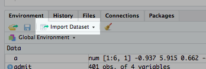
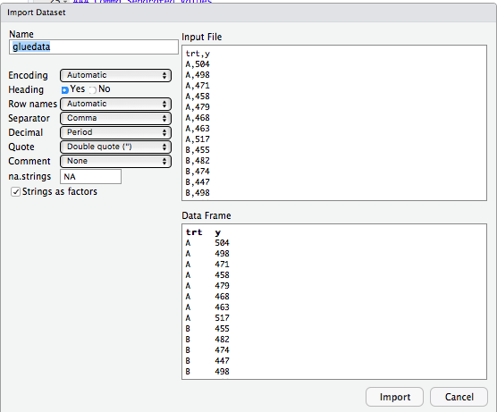

```{r setup, include=FALSE}
knitr::opts_chunk$set(echo = TRUE)
```

# Overview

---

This page gives a brief overview of common data file types, shows you the two main methods of getting your data into RStudio, one is a point-and-click method, and the other is with R code.

This tutorial assumes you have downloaded [R](https://www.r-project.org/) and [RStudio](https://www.rstudio.com/). I also assume you have some dataset you need to import into RStudio.

# File Types

---

### Comma Separated Values (`.csv`)

This will probably be the most common type of data file you see. CSV stands for "comma separated values". As you expect, if you look at the raw text file, you will see that each value is separated with commas, and thus these data files are very easy to create from scratch.


### Tab/whitespace separated files (`.tsv` and `.txt`)

Instead of having a comma between values, these files have a tabs or spaces.


### Excel (`.xlsx` and `.xls`)

If you save a Microsoft Excel workbook, it will probably have this extension. For simplicity, I would recommend that when you save the dataset, simply save it as a `.csv `or `.txt` file. Otherwise you will have to download additional packages like `xlsx` or `XLconnect` to work with the `.xlsx` format.

### XML (`.xml`)

This stands for Extensible Markup Language. You will need the package `XML` to work with this type of data. This tutorial will not cover working with this type of data.


# Point and Click Method

---

We will walk through an example of how to import a csv file from location on your computer.

This image shows the location of the "import dataset"" button. After selecting this button, a dropdown menu will show up, and you should select the file format your data is in. For this CSV example, we will select "From text". Next, find your datafile in the file browser and the dataset input dialog will show up next.



This image shows what the input dialog looks like. The right panel shows the raw input file. In this case, since it's a CSV file, we can see the commas between each of the values. The bottom panel shows what the inputted data will look like. One important option to mention is the "Header" option. This indicates if the first row of the CSV file is the name of the columns. Finally, the "Name" field at the top left of the window shows the variable name that the dataset will be saved as in your R environment.



After selecting import, a viewer window will show up to look at your data. We can also check our "console" to see the R code that ran from our point-and-click procedure. Our data is now imported as a data frame, and we can access the dataset through our specified variable name `gluedata`.

```
gluedata <- read.csv("~/Downloads/gluedata.csv")
View(gluedata)
```

# Code Method

---

From the point-and-click method above, we got a little taste of what the code we will need to import a dataset, but first we need a short aside into the concept of filepaths.

### File Paths

A filepath is a [string](http://www.linfo.org/string.html), or sequence of characters that specify a location on your computer. Note, MacOS and Windows use a different filesystem, and thus, the way to specify a file path is different. The concept is fairly illustrative with a few examples.

MacOS/Unix flavored systems

* `"~/Downloads/gluedata.csv"`
* `"/Users/mliou/Downloads/gluedata.csv"`
* `"~/Desktop/datasets/gluedata.csv"`

Windows

* `"~/Desktop/gluedata.csv"`
* `"C:/Users/mliou/Desktop/gluedata.csv"`

In the above examples, we can see the filepaths can start 2 different ways, a `~`, `/` or nothing. The character `~` is a shortcut for the "home directory". On my computer, it's a shortcut for `/Users/mliou`. The `/` denotes the top most directory of my computer, called the root folder. So the first two examples are two different ways to express the exact same location on my computer. Commonly we would simply use the `~` because it's faster than specifying the full path. If my file is not in my `Downloads` directory, I can specify directories levels deepeer with simply more forward slashes. For example, `~/Desktop/datasets/gluedata.csv` specifies there is a folder on my desktop named "datasets", and that "gluedata.csv" resides in that folder.

**Note**: Although filepaths on Windows computers are traditionally shown with `\` instead of `/`, the `\` has a different meaning in code, and thus the appropriate way to specify nested directories in R for Windows computers is with the forward slash `/`.


### Reading in data

We introduce 2 commands `read.table(...)` and `read.csv(...)`. We can think of `read.csv(...)` as a special instance of `read.table()` with different defaults for the command options. I'd glancing through the `?read.table` documentation before we begin.

Here I have two textfiles, one that is a comma separated file and the same dataset that is whitespace delimited.

| |  |
|:---:|:---|
|gluedata.txt|gluedata.csv|

```{r}
# Read the CSV file
gluecsv <- read.csv("~/Downloads/gluedata.csv", header=TRUE, sep = ",", skip=0)
head(gluecsv)

# Read the txt file
gluetxt <- read.table("~/Downloads/gluedata.txt",
                      header=FALSE,
                      sep = "",
                      skip = 1,
                      col.names = c("col1", "col2"))
head(gluetxt)
```

In reading the CSV file, the values inside the parentheses are called "arguments". The first positional argument we specify is the file path of where our `.csv` file is. The named arguments, (header,sep, skip), modify the behavior of how this function reads in the data. For example, by stating `header=TRUE` we are saying that the first row of the file contains the column names of the data of the following lines. The `sep=","` says that the separator between the data values is a comma. `skip=0` says we should not skip any rows before reading in the data; use the entire file. (Note that `header=TRUE, sep=",", skip=0` are all the default options for `read.csv`. You will get the same functionality if you only specify the file path, but we are explictly showing them here to compare them to `read.table(...)`.)

In comparison, if we are reading in a file that is whitespace delimited, we need to use the function `read.table(...)`. For this example, we do something slightly different and use the options to ignore the header row in the file `trt` `y` and rename them as `col1` `col2`. We use the options we learned previously, as well as a new option `col.names` to import our dataset. 

* `header=FALSE` says don't use the first row as the column names
* `sep=""` says the data is delimited by whitespaces.
* `skip=1` says skip the first row, and start from the second row
* `col.names=c("col1", "col2")` says name the two columns that you just read in as "col1" and "col2"

We use the function `head(...)` to display the first few rows of the dataset, and we can see our datasets read in as we wanted.

**Tip**: As you type out the file path, you can hit `<tab>` will bring up a small dialog box that helps complete the filepath. For example, if I type `read.csv("~/Downloads/gl<tab>")`, a list of files in directory `~/Downloads` that start with "gl" will show up, and I can use the arrow keys to select my file. This helps prevent typos and saves you a few keystrokes.

# Conclusion/Further References

For further reading or references, 

* [Datacamp](https://www.datacamp.com/community/tutorials/r-data-import-tutorial) if you have more complicated data import needs, including reading data from an `SQL` database, or `SPSS` files.

* [Quick-R](https://www.statmethods.net/input/importingdata.html) has more examples.


