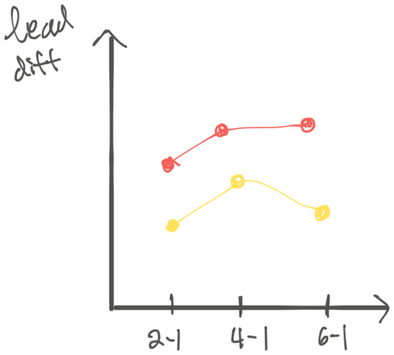

```{r setup, include=FALSE}
knitr::opts_chunk$set(echo = TRUE, cache=TRUE)
library(plm)
library(car)
library(skimr)
library(sloop) # For object sloothing
library(lme4) # mixed
library(nlme)
library(emmeans)
library(faraway)
library(tidyverse)
library(broom)
library(here)
library(kableExtra)
library(foreign)
library(lmeInfo) # for information matrices of lme models
library(broom.mixed)
library(ProfileLikelihood)
library(sandwich)
library(lmtest)
```

# Why Longitudinal Data Analysis

More information about the change, at the trade-off of needing to take repeated measurments.

## Specifics of LDA

-   Replication is a series of observations (each subject) and not individual measurements. Thus the EU is the subject.

## Approaches in LDA

-   Marginal (averages over population. state employee perspective)
-   (Random effects) Mixed Models (doctor perspective, subject specifics)
-   Transition Model (Ware et al, 1988)

## Historical Methods

### Split plot in time

-   Induces a compound symmetric structure with observations

### Repeated Measures ANOVA

I think this is the same as split plot in time... The model is

$$
Y_{ij} = X_{ij}'\beta + b_i + e_{ij}
$$ The covariance structure is *compound symmetry*, meaning

$$
\begin{aligned}
\text{Cov}(Y_{i}) = 
\begin{bmatrix}
\sigma_b + \sigma_e & \sigma_e & \dots &\sigma_e \\
 \sigma_e & \sigma_b + \sigma_e & \dots &\sigma_e \\
 \vdots & \vdots & \ddots & \vdots \\
 \sigma_e &  \sigma_e & \dots & \sigma_b + \sigma_e \\
\end{bmatrix}
\end{aligned}
$$

### MANOVA

Special case of the so called *profile analysis*. The main idea for MANOVA is to make some trasnformations and make some derived response varaibles to analyze. The multiple comes from having multiple responses. One is to make the sum of all the responses, to examine average over time. You could also create a variable for linear change across time, or quadratic change within subject.

There are some disadvantages though,

-   If design is unbalanced across time, MANOVA can't be used.
-   Also if there are any missing data, the entire case must be thrown out.

### Summary values

Reduce the sequence of each individual to a small set of summary values. Then, you can use the classic t-test or ANOVA, univariate tests.

-   Area under curve (AUC) - Can only be used when the people have the same time measurements.

Drawbacks

-   forces data analyst to think about one aspect of the repeated measures.
-   Might have the same summary measure but different response profile.
-   Method can't be applied if one of the covariates is time varying. b/c variance will not be constant from summary to summary.

## Inference on parameters

Likelihood test requires an additional fit on the null hypothesis, but better properties. Recommend Likelihood ratio based tests and CI. Note the RMLE is a correction for the data estimating both the mean and covariance.

# The setup

The short hand notation for the observations of a single individual are:

$$
\begin{aligned}
Y_{i} = X_{i}\beta + \varepsilon_{i}
\end{aligned}
$$ with $\varepsilon_i \sim N(0, \Sigma)$, which expanded would look like,

$$
\begin{aligned}
\begin{bmatrix}
y_{i1} \\
y_{i2} \\
\vdots \\
y_{in_{i}} \\
\end{bmatrix} = 
\begin{bmatrix}
X_{i11} & X_{i12} & \dots  &X_{i1p}  \\
X_{i21} &  X_{i22} & \dots  &X_{i2p}  \\
\vdots &  \vdots & \ddots  & \vdots  \\
X_{in_{i}1} &  X_{in_{i}2} & \dots  & X_{in_{i}p}  \\
\end{bmatrix}
\begin{bmatrix}
\beta_1 \\
\beta_2 \\
\vdots \\
\beta_p
\end{bmatrix} + 
\begin{bmatrix}
\varepsilon_{i1} \\
\varepsilon_{i2} \\
\vdots \\
\varepsilon_{in_{i}}
\end{bmatrix}
\end{aligned} 
$$

In total, we would stack them, so we have

$$
\begin{aligned}
\begin{bmatrix}
Y_1 \\
Y_2 \\
\vdots \\
Y_N \\
\end{bmatrix} =
\begin{bmatrix}
X_1 \\
X_2 \\
\vdots \\
X_N \\
\end{bmatrix}
\begin{bmatrix}
\beta_1 \\
\beta_2 \\
\vdots \\
\beta_p
\end{bmatrix} + 
\begin{bmatrix}
\mathbf{\varepsilon_{1}} \\
\mathbf{\varepsilon_{2}} \\
\vdots \\
\mathbf{\varepsilon_{N}}
\end{bmatrix}
\end{aligned}
$$ Thus, $\varepsilon$ has a block diagonal structure with each subject having the same covariance matrix.

# Modeling the Mean

This section follows 5.5 in @fitzmaurice_applied_2011.

The main questions to ask in this model are

1.  Group x time interaction effect - do the group means change over time. Biggest question of longitudinal studies normally
2.  Group effect - a main effect, but similar in normal analyses because if the interaction is significant, then, it's relatively meaningless to talk about these effects. (Note, if randomized trial, this should coincide with the interaction, because in randomized trial it was assumed that the two groups were the same.)
3.  Time effect - are they same across time?

There are primarily two ways of studying the longitudinal responses

1.  response profiles (perfect fit, treating time as a factor)
2.  (semi-) parametric form
3.  summary measure (like area under the curve)

## Example TLC {.tabset}

This is an exploratory plot summarizing the eventual statements we'd like to say about the model.

```{r}
tlc_raw <- read.csv("data/tlc.csv", header=FALSE)
names(tlc_raw) <- c("id", "trt","w0", "w1", "w4","w6")

tlc <- tlc_raw %>% gather("week", "lead", 3:6)

# numeric version of week
tlc$week_int <- tlc$week %>% gsub(".*([0-9]+).*", "\\1", .) %>% as.numeric()

# timepoint (1:4)
tlc$time <- c(1:4)[as.factor(tlc$week)]

# change from baseline
tlc_diff <- tlc %>% group_by(id) %>% 
  arrange(trt, id, time) %>% 
  mutate(lead_diff = lead - lead[1],
         lead_base = lead[1],
         trt = factor(trt, levels = c("P", "A"))) %>% 
  arrange(desc(trt), id, time) %>% 
  filter(week != "w0")
```

```{r}
tlc %>% ggplot(aes(x = week, y = lead, group = id)) +
  geom_line(alpha = .2) +
  facet_wrap(~trt)
```

```{r}
# Mean Response Profile by Trt
tlc_mrp <- tlc %>% 
  group_by(trt, week) %>% 
  summarise(mlead = mean(lead), 
            .groups = "drop_last")

tlc_mrp %>% 
  ggplot(aes(x = week, y=mlead, group=trt)) +
  geom_line(aes(linetype=trt)) +
  geom_point() +
  ggtitle("Lead over time") +
  theme_classic()
```

### SAS

```{SAS eval=FALSE}
* TLC data analysis example, from chapter 5;
* https://content.sph.harvard.edu/fitzmaur/ala2e/;

DATA tlc_long;
  INFILE "~/lda/tlc-data.txt" DLM=" ";
  input id group $ lead0 lead1 lead4 lead6;
  * create 4 observations from each row;
  y=lead0; time=0; output;
  y=lead1; time=1; output;
  y=lead4; time=4; output;
  y=lead6; time=6; output;
  drop lead0 lead1 lead4 lead6; * drop original "wide" data columns;
run;

/* set reference level */
/* http://support.sas.com/kb/37/108.html */
proc mixed noclprint=10 data=tlc_long
class id group(ref="P") time(ref="0");
model y = group time group*time / s chisq;
repeated time / type=un subject=id r;
lsmeans group / cl diff;
run;
```

<center>

<figure>

</img>

<figcaption>

</figcaption>

</figure>

<figure>

</img>

<figcaption>

</figcaption>

</figure>

<figure>

</img>

<figcaption>

</figcaption>

</figure>

</center>

### R: gls

We fit an unstructured covariance, with fully crossed time and treatment factors. In order to get the unstructured covariance matrix, we must use `gls`, for generalized least squares. This is basically

```{r modeling, paged.print=TRUE}
tlc$trt <- factor(tlc$trt, levels = c("P", "A")) # use P as the reference level

# Generalized Least Squares, defaults to REML
tlc_gls <- gls(lead ~ trt*week,
               corr=corSymm(form = ~ time | id),
               weights = varIdent(form = ~ 1 | week),
               data=tlc)

# Table 5.5 in Fitzmaurice
summary(tlc_gls)
```

The estimated (unstructured), marginal covariance structure can be extracted by `getVarCov`.

```{r}
getVarCov(tlc_gls) # covariance matrix
```

Getting the type III fixed effect tests, similar to SAS, is a little more work. There must be an easier way, but this shows how to do it manually. Here P0 denotes the mean of placebo at time 0.

| Conditional Mean ($\mu$) | Coef                                    |
|--------------------------|-----------------------------------------|
| P0                       | $\beta_1$                               |
| P1                       | $\beta_1 + \beta_3$                     |
| P4                       | $\beta_1 + \beta_4$                     |
| P6                       | $\beta_1 + \beta_5$                     |
| S0                       | $\beta_1 + \beta_2$                     |
| S1                       | $\beta_1 + \beta_2 + \beta_3 + \beta_6$ |
| S4                       | $\beta_1 + \beta_2 + \beta_4 + \beta_7$ |
| S7                       | $\beta_1 + \beta_2 + \beta_5 + \beta_8$ |

Furthermore, the Wald test statistic is

$$
\begin{aligned}
W^2 = (L\hat\beta)'\{L\mathrm{Cov}(\hat\beta)L'\}^{-1}L\hat\beta
\end{aligned}
$$ Compare the following table to the SAS Type 3 tests for Fixed Effects

```{r results=FALSE}
# variance of estimated coef, beta hat
covbeta <- tlc_gls$varBeta
beta <- coef(tlc_gls)

# testing interactions together, manually
trt_week_coef <- beta[6:8]
trt_week_cov <- covbeta[6:8, 6:8]
# t(trt_week_coef) %*% solve(trt_week_cov) %*% trt_week_coef

# avg treatment - avg control, H0: S = P
trt_L <- c(4, 4, 1, 1, 1, 1, 1, 1) - c(4, 0, 1, 1, 1, 0, 0, 0) %>% matrix() %>% t()# c(0,4,0,0,0,1,1,1)
# manually, its a scalar
# trt_L[c(2, 6:8)] %*% beta[c(2, 6:8)] * 
#   solve(trt_L[,c(2, 6:8)] %*% covbeta[c(2, 6:8), c(2, 6:8)] %*% cbind(trt_L[,c(2, 6:8)])) * 
#   trt_L[c(2, 6:8)] %*% beta[c(2, 6:8)]

# average by week, H0: w0 = w1 = w4 = w6
w0_L <- c(2, 1, 0, 0, 0, 0, 0, 0)
w1_L <- c(2, 1, 2, 0, 0, 1, 0, 0)
w4_L <- c(2, 1, 0, 2, 0, 0, 1, 0)
w6_L <- c(2, 1, 0, 0, 2, 0, 0, 1)
week_L <- matrix(c(w1_L - w0_L,
                   w4_L - w0_L,
                   w6_L - w0_L), nrow = 3, byrow=T)

# Combine the code above
rbind(anova(tlc_gls, L = trt_L), # Wald F value = 25.43
      anova(tlc_gls, L = week_L), # Wald F value = 61.49
      anova(tlc_gls, Terms = 4)) %>%  # Wald F value = 35.9
  as.data.frame() %>% 
  dplyr::mutate(Chisq = numDF * `F-value`,
                .after = `F-value`) %>% 
  add_column(source = c("Trt", "Week", "Trt x Week"), .before = 1)
```

### R: anova.gls

I'm not entirely sure what's going on in the anova function in nlme. There is a value for intercept and treatment, and I'm not sure how to interpret that.

It seems the week and interaction are being calculated correctly, not sure why the treatment is different from the manual calculations above. In the presence of an interaction effect however, it doesn't really matter.

Also notice that Chisq statistic is just the F statistic \* ndf. Assuming chisq gives more liberal estimates, effectively infinite residual degrees of freedom.

The following are two anova tables of the same model,

```{r class.source = "fold-show"}
# these results match
anova(tlc_gls, type = "marginal") # nlme
Anova(tlc_gls, "III", test.statistic = "F", error.df = tlc_gls$dims$N - tlc_gls$dims$p) # car w/ 392 error df
```

```{r class.source = "fold-show"}
# more liberal
Anova(tlc_gls, "III", test.statistic = "Chisq")
```

```{r eval = FALSE}
# not sure what's going on here
anova(tlc_gls, type = "sequential")
```

### R: lm

For comparison, we can see that gls gives the same estimates as the gls model, for profile curves, it basically goes through the mean of each group. lm is NOT the right way to do this analysis, but we want to see what it shows for comparison.

```{r}
tlc_lm <- lm(lead ~ trt*week, data = tlc)
cbind("gls" = coef(tlc_gls), "lm" = coef(tlc_lm))
```

compare the standard errors of the estimates though

```{r}
cbind("gls" = sqrt(diag(as.matrix(tlc_gls$varBeta))),
      "lm" = tlc_lm %>% tidy() %>% pull(std.error))
```

not quite sure this is the fairest comparison, but the heterogeneity in the estimated variance seems to have stabilized the standardized residuals. Need to double check if this is the right stabilization.

```{r}
plot(tlc_gls, resid(., type = "pearson") ~ week_int) # show against time (instead of default fitted)
plot(tlc$week_int, rstudent(tlc_lm))
```

```{r include = FALSE}
# something is not as expected here
# cbind(residuals(tlc_lm, type = "pearson"),
#       resid(tlc_gls, type = "pearson"))

```

### R: AUC

A third strategy is to do summary statistics of the curves. The section in the book refers to creating 1 df tests, which are more powerful than the overall F test of trt x time interaction. Often times, if you measure many many time points, the overall f test becomes diluted and it becomes more difficult to detect differences in the two curves, so these are designed to have more power than those tests. *should only be specified prior to analysis though, to keep with proper significance control*

We consider two tests,

1.  average difference minus baseline.

-   the contrast will take the form (where $n$ is the number of occassions)

$$
\begin{aligned}
L &= (L_1, -L_1) \\
L_1 &= \left(-1, \frac{1}{n-1}, \frac{1}{n-1}, \dots, \frac{1}{n-1}\right)
\end{aligned}
$$

2.  Area under curve (AUC) minus baseline

-   approximated by trapezoids

both of these can be formulated as a contrast, we'll use emmeans for convenience here.

```{r}
emm_tlc_gls <- emmeans(tlc_gls, specs=c("week", "trt"))
emm_tlc_gls

avg_minus_baseline_L <- c(-1, 1/3, 1/3, 1/3, 1, -1/3, -1/3, -1/3)
auc_minus_baseline_L <- c(5.5, -2, -2.5, -1, -5.5, 2, 2.5, 1)
contrast(emm_tlc_gls, list("avg minus baseline" = avg_minus_baseline_L,
                           "AUC minus baseline" = auc_minus_baseline_L))

anova(tlc_gls, L = avg_minus_baseline_L)
```

## Example: Ratdrink {.tabset}

The following example is from [\@faraway_extending_2016](#References)

```{r}
data(ratdrink)
ratdrink %>% ggplot(aes(weeks, wt, group = subject)) +
  geom_line() +
  facet_wrap(~treat)
```

### different intercepts

```{r message=FALSE, warning=FALSE}
# full lm
rat_lm <- lm(wt ~ weeks*treat + subject, data = ratdrink) # fixed "block"
rat_mmer <- lmer(wt ~ weeks*treat + (1|subject), data = ratdrink) # random "block"

# plotting the predictions
rat_preds <- ratdrink %>% add_column(lm_yhat = predict(rat_lm),
                                     mmer_yhat = predict(rat_mmer))
rat_preds %>% pivot_longer(c(wt, lm_yhat, mmer_yhat), names_to = "response", values_to = "y") %>% 
  ggplot() +
  geom_line(aes(weeks, y, groups = subject)) +
  facet_grid(response~treat)
```

### different slopes

The bottom row is the raw data while, the second row is the predictions from a random subject, and finally the top row is the predictions from the fully fixed model.

```{r fig.height = 6, message=FALSE, warning=FALSE}
rat_lm_diffslope <- lm(wt~weeks*treat + subject + subject:weeks, data = ratdrink)
# rat_mmer_interaction <- lmer(wt ~ weeks*treat + (1|weeks:subject), data = ratdrink) # weeks is continuous! doesn't work.... too many random effect intercepts
rat_mmer_interaction <- lmer(wt ~ weeks*treat + (1|subject) + subject:weeks, data = ratdrink) # weird model....b/c subject:weeks is fixed not sure when 
rat_mmer_random_slope <- lmer(wt ~ weeks*treat + (weeks|subject), data = ratdrink)
rat_mmer_random_slope_nocor <- lmer(wt ~ weeks*treat + (1 | subject) + (0 + weeks || subject), data = ratdrink) # without correlation between intercept and slope

rat_preds_slope <- ratdrink %>% add_column(lm_diffslope_yhat = predict(rat_lm_diffslope),
                                     mmer_interaction_yhat = predict(rat_mmer_interaction),
                                     mmer_random_slope_yhat = predict(rat_mmer_random_slope),
                                     mmer_random_slope_nocor_yhat = predict(rat_mmer_random_slope_nocor))

rat_preds_slope %>% 
  pivot_longer(c(wt, 
                 lm_diffslope_yhat, 
                 mmer_interaction_yhat, 
                 mmer_random_slope_yhat, 
                 mmer_random_slope_nocor_yhat), names_to = "response", values_to = "y") %>% 
  ggplot() +
  geom_line(aes(weeks, y, group = subject)) +
  facet_grid(response~treat)
```

```{r}
# profile conf intervals
confint(rat_mmer_random_slope)
```


## Example: Body Fat and Menarche

We use the MIT growth study menarche example for this section, from [Fitzmaurice website](https://content.sph.harvard.edu/fitzmaur/ala2e/)

Covariates/Response:

- id : girl id
- age : age at observation
- agemen : age of menarche for girl
- time : age - agemen, time relative to menarche.
- pbf : percentage body fat


```{r}
fat <- read.dta("data/fat.dta")

# select 20 random girls and show response curve
fat %>% 
  group_nest(id) %>% 
  slice_sample(n=20) %>% 
  unnest(data) %>% 
  ggplot(aes(time, pbf)) + 
  geom_point() +
  geom_line() +
  facet_wrap(~id) +
  geom_vline(xintercept = 0, color = "red")
```

### Modeling

@fitzmaurice_applied_2011 in chapter 8.8 analyzes this as a piecewise random effects model.

```{r}
# to fit piecewise function, need variable with after menarche time
fat_post <- fat %>% mutate(timepost = time * (time > 0)) # create variable for post menarche time
fat_lme <- lme(pbf ~ time + timepost,
    random = ~time + timepost | id,
    data = fat_post)
```

The fixed effects of the model:

```{r}
# Fixed effects
fat_lme %>% tidy() %>% filter(effect == "fixed") %>% 
  dplyr::select(term, estimate, std.error, statistic, df, p.value)
```

The random effects and standard errors calculated from inverse expected fisher information (with package `lmeInfo`)

```{r}
# https://stats.oarc.ucla.edu/r/faq/how-can-i-calculate-standard-errors-for-variance-components-from-mixed-models/
# Random effects and standard errors
fat_varcomp <- getVarCov(fat_lme)[upper.tri(getVarCov(fat_lme), diag = TRUE)]
cbind(estimate = fat_varcomp,
      `std. err` = sqrt(diag(varcomp_vcov(fat_lme)))[c(1, 2, 3, 4, 5, 6)])
```

# Testing for heteroskedasticiy and autocorrelation


- Goldfeld-Quandt - 2 subsamples with possibly different variances.
- Breusch-Pagan Test - for conditional heteroskedasticity
- White Test - more generalized test, including exogenous variables but also polynomial and interaction terms
- Breush-Godfrey Test - 
- Durbin Watson Test

There's 
- `strucchange::gefp` - structural change testing.

## Resources

- [Practical Econometrics Book](http://web.vu.lt/mif/a.buteikis/wp-content/uploads/PE_Book/4-7-Multiple-heteroskedastic.html)

# Modeling the Covariance

We should note that there are econometric approaches, such as sandwich estimators, and mixed model approaches that are all competing in the space of modeling the variance. Broadly there are three approaches for variance modeling:

1. random effects ("lme4")
2. generalized estimating equations ("gee")
3. feasible generalized least squares ("plm")

Packages with this approach from the [sandwich vignette](https://cran.r-project.org/web/packages/sandwich/vignettes/sandwich-CL.pdf)

- "sandwich"
- "multiwayvcov" - mostly lm or glm like objects
- "plm" -  several sandwich covariances for panel and fixed effect linear models.
- "geepack" - for glm type models, and subsequent geeglm objects
- "clubSandwich" - orginary or weighted least sqaures regression
- "clusterSEs" - ordinary or weighted least squares regression
- "lfe" - standard models

## Examples  {.tabset}

### Example: Spruce Trees

-   y: response (log of product of tree size and diameter squared)
-   tx: treatment ( 2 levels )
    -   0: control condition (25 trees per time point)
    -   1: ozone exposure at 70 ppb (54 trees per time point)
-   day: time (days since 1988 Jan 1)
-   chamber: block (ozone controlled chamber)

```{r import_spruce, include=FALSE}
day <- c( 152, 174, 201, 227, 258 )
spruce <- matrix(scan("data/spruce.data"), ncol=5, byrow=T )
tx <- c( rep(1,54), rep(0,25) )
chamber <- c( rep(1,27), rep(2,27), rep(3,12), rep(4,13) )
#
wide.spruce88 <- spruce
wide.day <- day
#
##
### build stacked data
##
#
ntrees <- nrow(spruce)
nobs <- ncol(spruce)
#
spruce88 <- data.frame(
  y = as.vector( t(spruce) ),
  day = rep( day, ntrees ) - 201,
  tx = rep( tx, rep(nobs,ntrees) ),
  chamber = rep( chamber, rep(nobs,ntrees) ),
  id = rep( c(1:ntrees), rep(nobs,ntrees) )  )
#
rm( day, spruce, tx, chamber )
```

```{r}
# str(spruce88)
# xtabs(~day + tx, data=spruce88)
# xtabs(~tx,data = spruce88)

# Example of selecting out some groups of elements for longitudinal analysis. Used above for highlighting
spruce88 %>% filter(id %in% sample(levels(spruce88[,"id"])))
sid <-spruce88 %>% group_by(chamber) %>% sample_n(5)
spruce_highlight <- spruce88 %>% filter(id %in% sid[["id"]])

# Emphasizing lines in the plot with background lighter
g_base <- ggplot(data = spruce88, mapping = aes(x=day, y=y, color = factor(tx), group=factor(id))) +
  facet_wrap(~chamber)
(g_base +
   geom_point(alpha=.2)+ geom_line(alpha=.2) + geom_line(data=spruce_highlight, aes(x=day, y=y, group=factor(id))))

# (g_base + geom_point(alpha=.2) + geom_smooth(span=.5, aes(group="abc")))
# Note: using a constant for the group, will override the previous grouping.
# Also, the smoothing will come up with "singularities" since there are only 5 distinct x data points, and lowess will have trouble.
```

### Exploring correlation from week to week, and getting correlation structure.

Suggestion if the data is taken at many different points, just round it to the nearest year and we can still get some sense of the correlation over time. In the case everything is discrete, we can just use the data categories as is.

We should remove the effect of the means from each week. The suggestion in the book is to remove the covariate effect by fitting a regression on the data.

```{r}

# remove the effect of means from each week
# residuals(lm(y~day + tx + chamber, data=spruce88))

str(spruce88)
spruce_resid <- spruce88 %>% mutate(resid = residuals(lm(y~day + tx + chamber)))
```

### Example: TLC

For exploratory analysis, we should show the unstructured estimated covariance matrix from the model, shown for an individual $i$,

$$
\begin{aligned}
Y_i = X_i\beta + \varepsilon_i
\end{aligned}
$$

assuming that $\varepsilon_i \sim N(0,\Sigma)$. We show the estimate $\hat \Sigma$ as unstructured covariance matrix:

This is table 5.3 in @fitzmaurice_applied_2011.

```{r}
# direct group means covariance
tlc_gls_un_cov <- gls(lead ~ trt*week,
                      correlation=corSymm(form = ~ time | id), 
                      weights = varIdent(form = ~ 1 | week), 
                      data=tlc)

getVarCov(tlc_gls_un_cov)
```

We can also look at the correlation with a scatter plot.

```{r}
tlc["week"] <- as.factor(tlc$week)

# Split into the exposed and placebo groups and make plots from the placebo group
tlc_exposed <- tlc %>% filter(trt == "A") %>% spread(week, lead)
tlc_placebo <- tlc %>% filter(trt == "P") %>% spread(week, lead)
pairs(tlc_placebo[3:6])
cor(tlc_placebo[3:6])
```

### Example: Body Fat and Menarche

The variance covariance matrix can be extracted in two ways:

```{r}
# using reStruct from model is scale version of covariance matrix
list(as.matrix(fat_lme$modelStruct$reStruct[[1]]) * fat_lme$sigma^2,
     getVarCov(fat_lme))
```

We can also model the within correlation differently with `correlation`

`corCAR1` - models the correlation by `phi = .2` (default), has autocorrelation function $h(\cdot)$, with parameters $s$ distance, and $\phi$ correlation

$$
\begin{aligned}
h(s, \phi) = \phi^s \quad s \geq 0, \phi \geq 0
\end{aligned}
$$

We can manually create the correlation matrix using this function and pairwise distances, or use the corStruct class in `nlme`.

```{r}
list(manual = .2^dist(fat_post$time[fat_post$id == 1]),
     lme = corMatrix(Initialize(corCAR1(form = ~time | id), data = fat_post))[[1]]) # phi = .2 default
```


```{r}
fat_car1 <- lme(pbf~time + timepost,
    random = ~ 1 | id,
    corr=corCAR1(,form= ~ time | id),
    data = fat_post)

fat_car1 %>% getVarCov(type = "marginal")
fat_lme %>% getVarCov(type = "marginal")
```


```{r}
getVarCov(fat_car1, type = "marginal")
VarCorr(fat_car1)
```


### Example: Dental

This section mostly uses `gls` with a variety of different covariance matrices.


This dataset shows measuruments of pituitary gland to pteryomaxillary fissure. It has 11 girls and 16 boys at ages 8, 10, 12, 14.

- id : patient id
- gender: male/female
- distance: the response variable


```{r}
dental_wide <- read.table("data/dental.txt",
                          header = FALSE,
                          col.names = c("id", "gender", "y1", "y2", "y3", "y4"))

# long data format
dental <- dental_wide %>% 
  pivot_longer(cols = y1:y4, 
               names_to = "age",
               values_to = "distance") %>% 
  dplyr::mutate(
    id = factor(id),
    age = recode(age,
                 y1 = 8,
                 y2 = 10,
                 y3 = 12,
                 y4 = 14),
    agef = factor(age),
    .after = "age")

dental_mean <- dental %>%
  group_by(age, gender) %>% 
  dplyr::summarize(avg_distance = mean(distance),
                   .groups = "drop_last")

dental %>% ggplot(aes(age, distance, group = id)) +
  geom_point(alpha = .3) +
  geom_line(alpha = .3) +
  geom_line(data = dental_mean, mapping = aes(age, avg_distance, group = NULL), color = "red") + 
  facet_wrap(~gender)
```

```{r}
# all fixed with id
dental_fixed <- lm(distance ~ age*gender + id, data = dental)
dental_lm <- lm(distance ~ age*gender, data = dental)
```

```{r}
# modeling covariance
dental_ident <- gls(distance~age*gender, data = dental) # same as lm

## heterogenous 
dental_het <- gls(distance~age*gender,
    data = dental,
    weights = varIdent(form = ~ 1 | age))

## unstructured
dental_un <- gls(distance ~ age*gender, 
    data = dental,
    correlation = corSymm(form = ~1 | id))

## heterogenous unstructured
dental_hun <- gls(distance ~ age*gender, 
    data = dental,
    correlation = corSymm(form = ~1 | id),
    weights = varIdent(form = ~1 | age))

## compound symmetry
dental_cs <- gls(distance ~ age*gender, 
    data = dental,
    correlation = corCompSymm(form = ~1 | id))

## Heterogenous CS
dental_csh <- gls(distance ~ age*gender,
    data = dental,
    correlation = corCompSymm(form = ~1 | id),
    weights = varIdent(form = ~1 | age))

## Autoregressive
dental_ar <- gls(distance ~ age*gender,
    data = dental,
    correlation = corAR1(form = ~1 | id),
    weights = varIdent(form = ~1 | age))

## Autoregressive Heterogeneous
dental_arh <- gls(distance ~ age*gender,
    data = dental,
    correlation = corAR1(form = ~1 | id),
    weights = varIdent(form = ~1 | age))
```


```{r results="hold"}
getVarCov(dental_un)
getVarCov(dental_hun)
getVarCov(dental_cs)
getVarCov(dental_csh)
getVarCov(dental_ar)
getVarCov(dental_arh)
```

```{r}
# Modelings including random effects
dental_lme <- lme(distance ~ age*gender, 
    random = ~1 | id,
    data = dental)
dental_lmer <- lmer(distance~age*gender + (1 | id), data = dental)

# same model in lmer and lme, G unstructured
dental_lmer_age <- lmer(distance ~ age*gender + (age | id), data = dental)
dental_lme_age <- lme(distance ~ age*gender, 
    random = ~ age | id,
    data = dental)

# uncorrelated age and id in random effect, G diag
dental_lme_age_diag <- lme(distance ~ age*gender,
                       data = dental,
                       random = list(id = pdDiag(form = ~age))) # heterogenous, but uncorrelated age and id (age || id) in lmer
dental_lmer_age_diag <- lmer(distance~age*gender + (age || id), data = dental)
```


```{r results = "hold"}
getVarCov(dental_lme)
getVarCov(dental_lme_age)
getVarCov(dental_lme_age_diag)

getVarCov(dental_lme, type = "marginal") # same as CS variance
getVarCov(dental_lme_age, type = "marginal")
getVarCov(dental_lme_age_diag, type = "marginal")
```


The covariance stuff is harder to calculate from lmer, I only know how to get from manual components, there may be something better that I don't know about.

```{r}
# G
VarCorr(dental_lmer_age)[[1]]

# Manual calculation of G = Sigma^2 L'L
L <- getME(dental_lmer_age, "Lambda") # Marginal covariance
sig <- getME(dental_lmer_age, "sigma")
(crossprod(L) * sig^2)[1:2, 1:2]

# ZGZ' + R
Z <- getME(dental_lmer_age, "Z")
G <- Matrix(diag(27)) %x% VarCorr(dental_lmer_age)[[1]] # hadamard
R <- Matrix(diag(rep(sigma(dental_lmer_age)^2, 108))) # 
varY <- Z %*% G %*% t(Z) + R # Var(Y)
varY[1:4, 1:4]
```


```{r}
# both criteria choose the cs matrix, the covariance is quite similar
AIC(dental_lm,
  dental_het,
    dental_un,
    dental_hun,
    dental_cs, 
    dental_csh,
    dental_ar,
    dental_arh,
    dental_lme) %>% 
  add_column(BIC = BIC(
    dental_lm,
    dental_het,
    dental_un,
    dental_hun,
    dental_cs,
    dental_csh,
    dental_ar,
    dental_arh,
    dental_lme)$BIC)
```


I was also curious how this compares to just calculating the sample covariance. It seems not all that different from the unstructured covariance matrix. They are different, but it seems the residuals being calculated are different. I thought ML estimator should be pretty close to the unstructured estimate.

```{r}
# sample covariance with group centering
dental %>% group_by(gender, age) %>% 
  mutate(cdist = distance - mean(distance, na.rm = TRUE)) %>%  # group center
  pivot_wider(id_cols = c(age), names_from = id, values_from = cdist) %>% # matrix format for cov 
  ungroup() %>% select(-age) %>% 
  data.matrix() %>% 
  t() %>% cov()
```


```{r}
# predictions from each of the models
dental_yhat <- dental %>% add_column(un = predict(dental_un),
                                     hun = predict(dental_hun),
                                     cs = predict(dental_cs),
                                     csh = predict(dental_csh),
                                     ar = predict(dental_ar),
                                     arh = predict(dental_arh),
                                     het = predict(dental_het),
                                     lme = predict(dental_lme),
                                     fixed = predict(dental_fixed),
                                     lm = predict(dental_lm),
                                     lme_age_diag = predict(dental_lme_age_diag),
                                     lme_age = predict(dental_lme_age))

dental_yhat %>% filter(id == 2) %>% 
  pivot_longer(cols = distance:lme_age, names_to = "type",
               values_to = "response") %>% 
  ggplot(aes(age, response, color = type)) +
  geom_point() +
  geom_line()
```

Here we examine what all these models actually predicted. For the marginal model, most of them are being predicted together, which makes sense. The "distance" are the raw values displayed for one individual. We can see that the fixed model (separate fixed effect for id) and total mean model (lm, also called pooled) runs with the other coefficients. As far as estimates go,  there are 3 separate groups, and probably some are due to rounding error. I think theoretically, the gls beta estimates should all be the same?


Now we should also be concered about the effects of `vcov` of the different models

The sandwich estimators here are also worth comparing. All estimators have the form $X'\hat\Sigma X$ with different "meat" for $\hat \Sigma$.

- HC0: Original white estimator
  - $\hat\Sigma = X'\{\hat\varepsilon_i^2\}_dX$
- HC1: adjust degrees of freedom of HC0
  - $\hat\Sigma = \frac{N}{N-(k+1)}X'\{\hat\varepsilon_i^2\}_dX$
- HC2: incorporate leverage
  - $\hat\Sigma = X'\left\{\frac{\hat\varepsilon_i^2}{1- h_{ii}}\right\}_dX$
- HC3: incorporate leverage with differnt weights
  - $\hat\Sigma = X'\left\{\frac{\hat\varepsilon_i^2}{(1- h_{ii})^2}\right\}_dX$
- HC4: incorporate leverage with differnt weights
  - $\hat\Sigma = X'\left\{\frac{\hat\varepsilon_i^2}{(1- h_{ii})^{\delta_{i}}}\right\}_dX$
  - $\delta_i = \min \{4, \frac{Nh_{ii}}{k + 1}\}$
  
  
For Heteroscedastic errors, there are HAC and Feasible Generalized Least Squares:

- 


```{r include = FALSE}
my_vcovHC0 <- function(model) {
  # (X'X)^{-1} X'ΩX (X'X)^{-1}
  X <- model.matrix(model)
  XX_inv <- solve(crossprod(X)) 
  XX_inv %*% t(X) %*% diag(model$residuals^2) %*% X %*% XX_inv
}

# library(sandwich)
# heteroskedastic covariances
dental_vcov_hc0 <- vcovHC(dental_lm, type = "HC0") # Heteroscedasticity-Consistent Estimator (Whites Estimator)
```

```{r}
# autocorrelated
NeweyWest(dental_lm) # Bartlett kernel weights
NeweyWest(dental_lm, lag = 0) #??
NeweyWest(dental_lm, lag = 1) # Bartlett kernel weights
vcovHAC(dental_lm)
vcovHAC(dental_lm, weights = weightsAndrews)
vcovHAC(dental_lm, weights = weightsLumley)

```

```{r}
# vcovPL is most appropriate I think, bu

vcovPL(dental_lm, cluster = ~age , kernel = "Bartlett")
vcovPL(dental_lm, cluster = dental$agef) # on the order
vcovCL(dental_lm, cluster = ~id)
vcov(dental_cs)
vcov(dental_lme_age) # is cluster supposed to be age?


```


```{r}
# standard errors are wildly different, why and how? Need to test reliability.
tidy(dental_csh)
coeftest(dental_lm, vcov = vcovCL, cluster = ~id)
coeftest(dental_lm, vcov = vcovPL, cluster = ~id) # almost 10x lower standard error?
coeftest(dental_lm, vcov = vcovHAC)
```

Introducing this many different ways for estimating "robust" standard errors is quite confusing.


# Random Coefficient Models

This is a method of adjusting for differing slopes and effects.

## Example: Autism

```{r}
autism <- read.csv("data/autism.csv") %>% 
  mutate(sicdegp = factor(sicdegp),
         childid = factor(childid)) 

autism_copy <- autism

autism %>% ggplot(aes(age, vsae, group = childid, color = sicdegp)) +
  geom_point() +
  geom_line() +
  facet_wrap(~sicdegp)
```

```{r}
# how many distinct in each
autism %>% count(sicdegp)
autism %>% count(sicdegp, childid) %>%
  pivot_wider(names_from = sicdegp, values_from = n)

# 2 missing vsae values
autism %>% lapply(rlang::as_function(~which(is.na(.x)))) # columnwise which missing
```


```{r}
# without child id
autism_lm <- lm(vsae ~ age*sicdegp, data = autism) # autism

# with child id
autism_lm_id <- lm(vsae ~ age*sicdegp + childid, data = autism)

# with id varying slopes
autism_lm_id_slope <- lm(vsae ~ age*sicdegp + childid + childid:age + childid:sicdegp, data = autism)


# predictions, plotted raw
autism_predict <- autism %>% filter(complete.cases(.)) %>% 
  add_column(
  yhat_lm = predict(autism_lm),
  yhat_lm_id = predict(autism_lm_id),
  yhat_lm_id_slope = predict(autism_lm_id_slope))

autism_predict %>% pivot_longer(cols = c(vsae, starts_with("yhat")),
                                names_to = "type",
                                values_to = "y") %>% 
  ggplot(aes(age, y, group = childid, color = type)) +
  geom_line(alpha = .2) +
  facet_grid(type~sicdegp)

```

```{r}
# fully fixed
c(slope1 = coef(autism_lm)[2],
  slope2 = sum(coef(autism_lm)[c(2,5)]),
  slope3 = sum(coef(autism_lm)[c(2,6)]))
# with id
c(slope1 = coef(autism_lm_id)["age"],
  slope2 = sum(coef(autism_lm_id)[c("age", "age:sicdegp2")]),
  slope3 = sum(coef(autism_lm_id)[c("age", "age:sicdegp3")]))
```


```{r}
# TODO: with id_slope
# average coefficients for each fitted child? seems okay way to summarize this fixed effects model.
rg_lm_id_slope <- ref_grid(autism_lm_id_slope, at = list("age" = c(2, 3), "sicdegp")) # nesting
emmp_lm_id_slope <- pairs(emmeans(rg_lm_id_slope, specs = c("age", "sicdegp"), by = "childid")) %>% as.data.frame()
emmp_lm_id_slope %>% group_by(sicdegp) %>% 
  summarize(mean_slope = -mean(estimate, na.rm = TRUE)) %>% pull(mean_slope)
```

```{r}
# random models
autism_lme_id <- lme(vsae~age*sicdegp,
                  random = ~ 1 | childid,
                  data = autism[complete.cases(autism),])

autism_lmer_id <- lmer(vsae~ age * sicdegp + (1| childid),
                       data = autism)

autism_lmer_id_slope <- lmer(vsae~ age * sicdegp + ( age | childid),
                             data = autism)

autism_lmer_id_slope_split <- lmer(vsae~ age * sicdegp + (1 | childid) + ( 0 + age | childid),
                             data = autism)

# uncorrelated intercept and age
autism_lmer_id_slope_uncor <- lmer(vsae ~ age * sicdegp + (age || childid),
                             data = autism)

# unstructured covariance matrix
gls(vsae~age*sicdegp,
    random = ~1 | childid,
    correlation = corSymm(form = ~),
    weights = varIdent(form = ~ age) 


autism_lme_id_slope <- lme(vsae~age*sicdegp,
                           random = ~ age | childid,
                           data = autism[complete.cases(autism),],
                           control = lmeControl(opt = "optim"))

summary(autism_lme_id_slope)


# lmer_id
c(fixef(autism_lmer_id)["age"],
  sum(fixef(autism_lmer_id)[c("age", "age:sicdegp2")]),
  sum(fixef(autism_lmer_id)[c("age", "age:sicdegp3")]))

# lme_id_slope
c(fixef(autism_lme_id_slope)["age"],
  sum(fixef(autism_lme_id_slope)[c("age", "age:sicdegp2")]),
  sum(fixef(autism_lme_id_slope)[c("age", "age:sicdegp3")]))
```


```{r}
# random models
```


# Baseline adjustment

There are 4 ways that we can discuss for baseline adjustment from @fitzmaurice_applied_2011 chapter 5.7

1.  Keep in outcome vector, no assumptions about group differences in mean response at baseline. "baseline group different" (basically what we did prior)
2.  Keep in outcome vecto, make assumption that group means are equal at baseline (like in randomized trial) "no baseline
3.  Subtract baseline response from post-baseline. Analyze the diffrences from baseline
4.  Use baseline value as a covariates in the analysis of the post-baseline responses.

In summary, Fitzmaurice shows and recommends:

-   1 = 3.
-   2 is just as efficient as 4
-   2 is more efficient than 1.
-   assumption 2 is most accurate in a randomized control trial, in which you expect baseline to be similar. introducing backdoor bias (conditioning on collider) may happen in observational studies. In which case use 1

Depending on the strategy that you choose, the interpretation of the coefficients will differ, so beware, although some cases reduce to linear combinations of the coefficients.

We examine the differences of these 4 approaches on the TLC dataset.

## Method Implementations {.tabset}

### 1. raw

<figure>

<center>

</img>

<figcaption>

</figcaption>

</center>

</figure>

This method is just the standard response profile analysis, which we've shown above.

```{r}
tlc_baseline_1 <- tlc_gls
```

### 2. constrain baseline

<figure>

<center>

</img>

<figcaption>

</figcaption>

</center>

</figure>

In order to force baseline to be modeled the same, we need to remove the main effect for treament, and the interaction term involving the baseline. Unfortunately we can't remove a single level of the interaction if we specify `week*trt`, nor does `gls` accept a manually made model matrix, so we must construct the variables through the formula interface.

```{r}
# keep in outcome, assume similar intercept 
# remove main effect, and week0 interactions.
# gls doesn't take model.matrix, so manual specification through formula is the way to do it
# update also acts kinda weird
# table 5.7  in Fitzmaurice
# https://content.sph.harvard.edu/fitzmaur/ala2e/

tlc_baseline_2 <- gls(lead ~ week + 
                        I(week == "w1" & trt == "A") +
                        I(week == "w4" & trt == "A") +
                        I(week == "w6" & trt == "A"),
                      data = tlc,
                      correlation = corSymm(form = ~ time | id),
                      weights = varIdent(form = ~ 1 | week))

# type III fixed effect test for interaction hypothesis
anova(tlc_baseline_2, Terms = 3:5) # Chisq = F * ndf = 111.94
```

### 3. change from baseline

<figure>

<center>

</img>

<figcaption>

</figcaption>

</center>

</figure>

This analysis is just a reframed version of the first analysis, at least in terms of estimates.

```{r}
# modeling the difference
# time - 1, because gls throws error. corSymm needs consecutive integers starting at 1.
tlc_baseline_3 <- gls(lead_diff ~ trt*week,
                      correlation = corSymm(form = ~ time-1 | id), # unstructured
                      weights = varIdent(form = ~ 1 | week),  # heterogenous
                      data = tlc_diff %>% mutate(trt = factor(trt, levels = c("P", "A"))))

anova(tlc_baseline_3, Terms = c(2, 4)) # trt x week interaction test is now test on combined c(trt, trt:week) of diff
```

::: {style="display:flex;justify-content:center;align-items:flex-start"}
```{r echo = F}
#  %>% kbl("html") %>% kable_styling(full_width = FALSE, position="float_left")
# 
raw_table <- coef(tlc_gls) %>% enframe(name = "term", value = "raw")
change_table <- coef(tlc_baseline_3) %>% enframe(name = "term", value = "change")

change_table %>% 
  kbl(caption="Baseline Change Coefficients",
      table.attr = "style='width:30%;'") %>% 
  kable_styling(position = "float_left")
raw_table %>% 
  kbl(caption="Raw Coefficients", 
      table.attr = "style='width:30%;'") %>%
  kable_styling(position = "left")
```
:::

To see that they are the same, notice that the baseline change model term estimates are simply linear combinations of the raw model.

```{r}
tribble(~`change model`, ~`raw model terms`, ~`value` , ~`interpretation`,
        "(Intercept)", "weekw1", "-1.612",  "in placebo, diff between w1 and baseline",
        "trtA", "trtA:weekw1", "-11.406",  "difference in trt slopes from baseline to w1",
        "weekw4", "weekw4 - weekw1","-0.59", "in placebo, diff between w4 and w1",
        "trtA:weekw4", "trtA:weekw4 - trtA:weekw1","2.582", "diff in trt slope from w4 to w1") %>% kbl() %>% kable_styling(full_width = FALSE)
```

Given that they are the same (or linear combinations), what about the standard errors of the estimates? Let's check for "weekw4"

```{r}
cbind(c(-1, 1) %*% tlc_gls$varBeta[3:4, 3:4] %*% c(-1, 1), # old model std err
      tlc_baseline_3$varBeta["weekw4", "weekw4"]) # baseline change model std err
```

They are the same!

```{r}
list(raw = tlc_gls$varBeta,
     base3=tlc_baseline_3$varBeta)
```

The marginal covariances are also the same *if we change the estimation method to ML*.

The idea here was that we could calculate the change from baseline covariance estimate from the raw model estimates of covariance.

$$
\begin{aligned}
\underbrace{\widehat{\mathrm{Cov}}(Y_{i2} -Y_{i1}, Y_{i2} -Y_{i1})}_{\Delta \text{ baseline model estimates}} = \underbrace{\widehat{\mathrm{Var}}(Y_{{i2}}) - 2\widehat{\mathrm{Cov}}(Y_{i2}, Y_{i1}) + \widehat{\mathrm{Var}}(Y_{i1})}_{\text{Raw model estimates}}
\end{aligned}
$$

```{r}
# We note this is NOT true when we use the REML estimates
# linear 
L <- matrix(c(-1, 1, 0, 0,
              -1, 0, 1, 0,
              -1, 0, 0, 1), byrow = TRUE, ncol = 4)

# not the same!
list(`from_baseline_change_model` = getVarCov(tlc_baseline_3),
     `from_raw_model` =  L %*% getVarCov(tlc_baseline_1) %*% t(L))
```

With REML estimates, they are NOT equal. But if we refit the models with ML,

```{r}
# what if we try ML?
tlc_baseline_3_ml <- tlc_baseline_3 %>% update(method = "ML")
tlc_baseline_1_ml <- tlc_gls %>% update(method = "ML")
```

```{r}
list(`from_baseline_change_model` = getVarCov(tlc_baseline_3_ml),
     `from_raw_model` =  L %*% getVarCov(tlc_baseline_1_ml) %*% t(L))
```

### 4. ancova change

This method results in standard error estimates that are more efficient, but generally only recommended for randomized studies. In observational studies, there's danger in introducing bias.

We can do ancova on the raw values, or change from baseline values. That is, we could consider either:

```{=tex}
\begin{enumerate}
\item
$$
\begin{aligned}
Y_{ij} = X_{ij}\beta^{(ancova)} + Y_{i1}\gamma + \varepsilon_{ij} 
\end{aligned}
$$
\item
$$
\begin{aligned}
Y_{ij} - Y_{i1} = X_{ij}\beta^{(ancova)} + Y_{i1}\gamma' + \varepsilon_{ij} 
\end{aligned}
$$
\end{enumerate}
```
Both of these will give the same estimates (maybe obviously when written out this way), but $\gamma' = \gamma + 1$.

```{r}
# ancova
tlc_baseline_4 <- gls(lead ~ trt*week + lead_base,
                      correlation = corSymm(form = ~ time-1 | id), # unstructured
                      weights = varIdent(form = ~ 1 | week),  # heterogeneous
                      data = tlc_diff)

tlc_baseline_4b <- gls(lead_diff ~ trt*week + lead_base,
                       correlation = corSymm(form = ~ time-1 | id), # unstructured
                       weights = varIdent(form = ~ 1 | week),  # heterogeneous
                       data = tlc_diff)

cbind(coef(tlc_baseline_4),
               coef(tlc_baseline_4b)) %>% 
  `colnames<-`(c("Ancova", "Ancova Diff")) %>% 
  as.data.frame() %>% 
  rownames_to_column("term")
```

## Comparison

It's hard to compare the estimates of the coefficients directly, so we compare them for the hypothesis test of the treatment by time interaction.

```{r}
# contrast matrix for tlc_baseline_3
# trtA (interaction w1), trtA + trtA:w4, trtA + trtA:w6
L <- matrix(c(0, 1, 0, 0, 0, 0,
              0, 1, 0, 0, 1, 0,
              0, 1, 0, 0, 0, 1), byrow = T, nrow = 3)
rbind(
  `raw` = anova(tlc_baseline_1, Terms = 4),
  `constrain baseline` = anova(tlc_baseline_2, Terms = 3:5),
  `baseline change` = anova(tlc_baseline_3, L = L), # same as tlc_baseline_1 as expected
  `ancova` = anova(tlc_baseline_4, Terms = c(2,5))) %>%  # similarly efficient as baseline 2 model
  as.data.frame() %>% 
  mutate(`Chisq` = numDF * `F-value`,
         .after= `F-value`)
```

We see that 2 and 4 have larger F-statistics, implying that there is slightly more power to detect the group differences (assuming the assumptions are reasonable).

@fitzmaurice_applied_2011 concludes that 2 should be recommended, because we get similar efficiency gains, and there is an implicit assumption about the covariance matrix of the ancova model. In the ANCOVA model, we only have a 3x3 covariance matrix, where as in baseline change model, we estimated a 4x4 covariance matrix. Hence, we are implicitly assuming that $\mathrm{Cov}(Y_{i1}, Y_{i2}) = \mathrm{Cov}(Y_{i1}, Y_{i3}) = \mathrm{Cov}(Y_{i1}, Y_{i4})$

```{r}
tlc_baseline_4 %>% getVarCov()
```

## References {#references}

-   [European Agency for evaluation of medicinal products](https://www.ema.europa.eu/en/documents/scientific-guideline/points-consider-adjustment-baseline-covariates_en.pdf) from a quick google search

# Residuals

Residuals from a longitudinal model will be correlated. @fitzmaurice_applied_2011 recommends that we "decorrelate" them with a cholesky decomposition of the estimated covariance of the errors. It can get confusing with the estimators and terminology here...

$$
\begin{aligned}
\varepsilon &= Y_i - X_i\beta \\
\hat\varepsilon &= Y_i - X_i \hat\beta \\
\mathrm{Cov}(\varepsilon) &= \Sigma \\
\widehat{\mathrm{Cov}}(\varepsilon) &= \hat\Sigma \\
\mathrm{Cov}(\hat\varepsilon) &= ??
\end{aligned}
$$

We assume that $\mathrm{Cov}(\hat \varepsilon) \approx \mathrm{Cov}(\varepsilon)$.

## Decorrelation

```{r}
# can extract residuals with type = "normalized"
fat_post %>% count(id)
S <- getVarCov(fat_lme, type = "marginal", individuals = 1)
S
R <- S[[1]] %>% chol()
R
crossprod(R) # R'R

```


```{r}
eps_hat <- residuals(fat_lme, type = "pearson")
eps_hat[fat_post$id == 1]
Rinv <- solve(R)
eps_hat[fat_post$id == 1] %*% Rinv
```


```{r}
residuals(fat_lme, type = "normalized")[fat_post$id == 1]

fat_lme$modelStruct
```

```{r}
?nlme:::recalc
nlme:::residuals.lme
```


## Aggregation

The next method deals with aggregation


# Econometrics Approaches

The Econometrics methods that deal with longitudinal data is a little different than statistics. We'll explore the terminology and methods here.

-   Pooled Model

# Software Comparisons

-   plm (unequal observations between groups, needs adjustment from nlme)
-   lme4, nlme (maximum likelihood approach, not intuitive)

# PLM Vignette

Provides functions for panel data from "econometricians" point of view.

Provides a few functions

## `plm`

-   the fixed effects model ("within"),
-   the pooling model ("pooling"),
-   the first-difference model ("fd"),
-   the between model ("between"),
-   the error components model ("random").

### EmplUK

-   firm - firm index
-   year - year
-   sector - the sector of activity
-   emp - employment
-   wage - wages
-   capital - capital
-   output - output

```{r}
data("EmplUK")
```

```{r}
# pdata.frame creats a dataframe for plm to work with
E <- pdata.frame(EmplUK,                 # The orig dataframe
            index=c("firm","year"),      # The "individual" and "time" variable names
            drop.index = TRUE,           # Don't show index columns
            row.names = TRUE)            # Show rownames that combine individual-time

class(E) # pdata.frame

summary(E$emp) # Selecting the column from a pdata.frame give a "pseries" object
methods(class="pseries") # Looking at the methods with a pseries object
# plm:::print.summary.pseries
# plm:::summary.pseries # The function for summarizing the series
```

pseries datatype comes with various functions to operate on them to compute correctly time lag within each individual

```{r eval=FALSE}
between(E$emp) # means across the time periods
Sum(E$emp) # sum across the time periods
Within(E$emp) # deviation from mean
head(plm:::lag.pseries(E$emp, 0:2)) # Lag the sequence within subject by however many
```

### Grunfield example

```{r eval = TRUE}
data(Grunfeld)
Grunfeld$firm <- factor(Grunfeld$firm)
Grunfeld$year <- factor(Grunfeld$year)

skim(Grunfeld)
```

```{r}
Grunfeld %>% ggplot(aes(year, inv, color = factor(firm))) + 
  geom_line()
```

```{r}
grun.po <- plm(inv~value + capital, data = Grunfeld, model = "pooling") # pooled
grun.fe <- plm(inv~value + capital, data = Grunfeld, model = "within") # fixed effects
grun.re <- plm(inv~value + capital, data = Grunfeld, model = "random") # random effects
grun.fd <- plm(inv~value + capital, data = Grunfeld, model = "fd") # first difference

summary(grun.po)
summary(grun.fe)
summary(grun.re)
summary(grun.fd)
```

```{r}
# Statistical equivalent
summary(lm(inv~value + capital, data = Grunfeld)) # pooled
summary(lm(inv~firm + capital + value, data = Grunfeld)) # fixed effects
summary(lmer(inv~ (1|firm) + capital + value, data = Grunfeld)) # random model, but different random effect estimators
```

# GLS

See [Wikipedia](https://en.wikipedia.org/wiki/Generalized_least_squares), the article is fairly comprehensive.

```{r include = FALSE}
# Linear Models Method
tlc$id <- as.numeric(tlc$id)
tlc_lmm <- lmer(lead ~ trt + week + (1|id), data=tlc)
tlc_lmm_summary <- summary(tlc_lmm)
```

Common forms of the `gls` command are as follows (from @pinheiro_mixed-effects_2000):

-   `gls( model, data, correlation )` - correlated errors
-   `gls( model, data, weights )` - heteroscedastic errors
-   `gls( model, data, correlation, weights )` - both

We can play around with the structure of covariance matrices with:

```{r}
# In order to specify the correlation structure to be unstructured, we allow each group to be different for id. But for each time point to be related.
# ?corSymm
# corSymm(form=tlc$time | tlc$id)
# In order to see all the correlation matrices for just the first individual
corMatrix(Initialize(corSymm(form= ~ 1 | id), data=tlc))$`1`
```

# References {#References}
