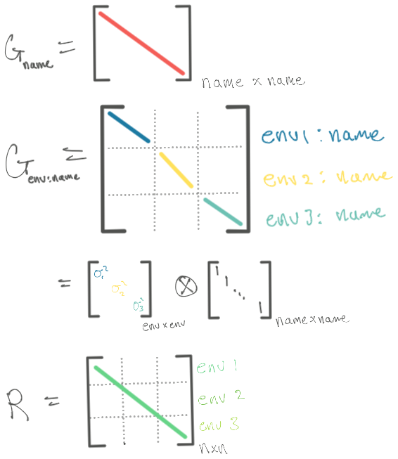

```{r setup, include=FALSE}
knitr::opts_chunk$set(echo = TRUE, cache = TRUE)
library(lattice)
library(lme4)
library(nlme)
library(glmmTMB) # template model builder, designed as improved glmmADMB
library(tidyverse)
library(emmeans)
library(broom.mixed) # clean mixed model outputs
library(sommer) # asREML replacement
library(sjPlot) # for plottinge effects
library(kableExtra) # for tables
library(afex) # easy anova
```

# Introduction to Mixed Models

## Mixed Model Ecosystem

Mixed model software is widely available for most use case scenarios in most commonly used statistical software. Although there are some implementational differences between the software (optimizers, defaults, design philosophy).

### R Package Overview

* **lme4**
* **nlme**

### SAS Overview

## Example Datasets {.tabset}

* Oats from `nlme` package (balanced split plot design)
  
* sleepstudy from `lme4` package

### Oats

* Oats is a good example of a balanced split-plot design, from the **nlme** package.
* We will remove some data observations to make it incomplete, like they do in [emmeans documentation](https://cran.r-project.org/web/packages/emmeans/vignettes/sophisticated.html)

Oats has 3 factors, `yield ~ nitro | block/variety`

* yield (continuous)
* nitro (4 levels)
  - 0.0
  - 0.2
  - 0.4
  - 0.6
* Variety (3 levels)
  - Victory
  - Golden Rain
  - Marvellous
* Blocks (6 levels)


```{r}
# intentionally removing some observations
oats_miss <- Oats[-c(1, 2, 3, 5, 8, 13, 21, 34, 55),]
```

### Sleepstudy

* sleepstudy is a good example of random intercept and coefficient with subject random effect.
* sleep study is accessible from **lme4** package with `sleepstudy`
* most examples for lme4 will feature this dataset.

## Resources

* [Ben's Introduction to Mixed Models](https://bbolker.github.io/morelia_2018/notes/mixedlab.html) - basic lab with examples of how to approach mixed models by a prominant mixed models expert.

# Basic Theory

For a model that shows this \textit{per subject},

\begin{equation}
         Y_i = X_i\beta + Zu_i + e_i
\end{equation}

with assumptions,

 1. $u_i\sim MVN(0, D)$
 2. $e_i\sim MVN(0, R)$
 3. $Cov(u, e) = 0$  (Violation of this results in parameter confounding.)


# Basics of Mixed Models in R

Some common accessor functions for working with mixed models and what they return:

- `summary()` - all the important information
- `fixef()` - the $\beta$ part of the equation
- `ranef()` - the $u$ part of the equation
- `getME()` - Get very specific components of an object of class `merMod`. See the help function for full list
  - `X` - fixed-effects model matrix
  - `Z` - random-effects model matrix
  - `mu` - conditional mean of response
  - `b` - conditional mode of random effects variable
 
 
```{r}
# Oats Model
oats_mod <- lme4::lmer(yield~Variety + factor(nitro) + (1|Block/Variety), data = oats_miss, REML = TRUE)
sleep_mod <- lmer(Reaction ~ Days + (Days | Subject), data=sleepstudy)
```


```{r}
summary(oats_mod)
summary(sleep_mod)
```


## Fixed Effects

The reported fixed effects from `fixef(mod)` is really just the average of all across all the individual fits that were created

```{r collapse=TRUE}
# These are the same! 
fixef(sleep_mod) # %>% as.data.frame() # makes it nicer to work with
colMeans(coef(sleep_mod)$Subject)
```


```{r eval = FALSE}
# Results aren't shown, but this is how to get them.
summary(oats_mod)
ranef(oats_mod) # %>% as.data.frame() # makes it nicer to work with
fixef(oats_mod) # %>% as.data.frame() # makes it nicer to work with

# Something to do with subject level standard errors
attr(ranef(oats_mod, condVar = TRUE, drop = TRUE)$`Variety:Block`, "postVar")

# Standard errors for random effects
print(vc <- VarCorr(oats_mod), comp = c("Variance", "Std.Dev.")) %>%
  as.data.frame(order = "lower.tri")
```


## Random Effects

```{r results='hide'}
# From the help on ranef
str(ranef(sleep_mod))
as.data.frame(ranef(sleep_mod))
rr <- ranef(sleep_mod)
dd <- as.data.frame(rr)
dotplot(rr,scales = list(x = list(relation = 'free')))[["Subject"]] # This just allows the x access to be different between the two objects
```


```{r collapse=TRUE}
# How to replicate dotplot in ggplot!
# The "free_x" is allowing different value scales...
ggplot(dd, aes(y=grp,x=condval)) +
  geom_point() + facet_wrap(~term,scales="free_x") +
  geom_errorbarh(aes(xmin=condval -2*condsd,
                     xmax=condval +2*condsd), height=0)
```

### Random Effect Variance

More specifically, these are the variances of the conditional modes

```{r}
cov_mat <- VarCorr(sleep_mod)[["Subject"]]
cov_mat # shows the correlation between random effects as well
print(VarCorr(sleep_mod), comp=c("Variance")) # extract the variance estimates of random effects (shown in summary)
```

Similarly, the conditional variance-covariance matrix of the random effects can be extracted by the following. These variances are conditional on the data and 

```{r}
attr(ranef(sleep_mod)$Subject, "postVar")
# ?ranef
```

A cleaner data frame version of the above with standard deviations, (no correlation)

```{r}
as.data.frame(ranef(sleep_mod))
# broom.mixed alternative, with same output
broom.mixed::tidy(sleep_mod, effects = "ran_vals")
```

## Plotting Effects

There are a few packages that automate the effect plotting

- "effects"
- "ggeffects"
- ["sjPlot"](https://cran.r-project.org/web/packages/sjPlot/vignettes/plot_model_estimates.html)

```{r}
# sjPLot
plot_model(oats_mod,
           show.values = TRUE,  # show overlay
           value.offset = .3) # offset above
```
some useful options

- `terms = c("factor(nitro)0.2", "factor(nitro)0.4"`

# Variance Structures in Mixed Models

The example that we use throughout this section is a [multi-environment potato RCBD](https://rdrr.io/cran/sommer/man/DT_example.html) (`DT_example` from the `sommer` package). The covariates are:

* `Name` - the genotype
* `Env` - location/year combination.
* `Block` - coded uniquely across the environments
* `Yield` - a response, the number of potatoes from the plant
* `Weight` - another response, weight of the potatoes, to illustrate multiple trait experiments

```{r}
data(DT_example) # library(sommer)
```

```{r}
DT_example %>% ggplot(aes(Name, Yield)) +
  geom_point() + 
  facet_grid(Env~.)
```

## Ecosystem Overview {.tabset}

The R packages that can do forms of variance covariance structures

* afex - todo
* sommer - takes an AS-REML approach to fitting the variance components. They overview their package in [this paper](https://journals.plos.org/plosone/article?id=10.1371/journal.pone.0156744#), they implement three programs for fitting: 
  * ["Average Information REML"](http://faculty.washington.edu/tathornt/BIOST551/articles_2012/AverageInformation.pdf) - original paper by same authors of the AS-REML package. A great example of this optimization step with an example is given in a book chapter by author of "sommer" package [Overview of Major Computer Packages for Genomic Prediction of Complex Traits](https://link.springer.com/protocol/10.1007/978-1-0716-2205-6_6)
  * ["Efficient Mixed Model Association (EMMA)"](https://academic.oup.com/genetics/article/178/3/1709/6061473?login=false) - 
* MCMCglmm - takes a bayesian simulation approach to mixed modeling
* emmREML - implements the mixed model association, mentioned above.
* glmmTMB ([R Package](https://cran.r-project.org/web/packages/glmmTMB/index.html)) ([Paper](https://journal.r-project.org/archive/2017/RJ-2017-066/RJ-2017-066.pdf)) - is primarily a glmm package that uses lme4 based formula syntax. It uses the r package `TMB` in the background, which is MLE based and uses Laplace 
* SAS ([Docs](https://documentation.sas.com/doc/en/statcdc/14.2/statug/statug_mixed_details01.htm)) ([paper](https://www.researchgate.net/publication/242913395_Computing_Gaussian_Likelihoods_and_Their_Derivatives_for_General_Linear_Mixed_Models)) - uses a sweep method on the REML and ML profiled likelihood. There's good discussion of the methods in their documentation.

```{r results = "asis", echo = FALSE}
eco_var_tbl <- 
  tribble(~package, ~commercial, ~link, ~estimation, ~rating,
          "glmmTMB", "Free", "https://cran.r-project.org/web/packages/glmmTMB/index.html", "ML, REML", "★★",
          "sommer", "Free", "https://cran.r-project.org/web/packages/sommer/", "ML (NR, AI, EMMA), REML (NR, AI, EMMA)", "★★★★",
          "lme4", "Free", "https://cran.r-project.org/web/packages/lme4/", "Cholesky decomposition of Sparse PSD matrix", "★",
          "nlme", "Free", "https://cran.r-project.org/web/packages/nlme/", "EM -> NR of profiled log likelihood", "★★★★",
          "SAS", "Paid", "https://documentation.sas.com/doc/en/statcdc/14.2/statug/statug_mixed_details01.htm", "Sweep based on W-Transformation", "★★★",
          "AS-REML", "Paid", "https://vsni.co.uk/software/asreml-r", "Average Information REML", "★★★")

eco_var_tbl %>% mutate(software = cell_spec(package, "html", link = link), 
                       .keep="unused", .before = 1) %>%
  kbl(escape = FALSE) %>% 
  kable_styling(bootstrap_options = c("hover", "condensed"))

```


### nlme

This section we use the "Oxide" example p167 in Mixed-Effects Models in S and S-PLUS.

nlme introduces the class "groupedData", for which has a natural methods for which we can use

lme also has a LOT of variance classes that can fit R variances of individuals according to covariates as well! See ?varClasses for the documentation of this and see [MLM Heterogenous Variance](https://quantdev.ssri.psu.edu/sites/qdev/files/ILD_Ch06_2017_MLMwithHeterogeneousVariance.html) for an example.


Many methods that apply to class `lme` objects,

* `intervals(lmod)` - confidence intervals around parameters
  * "using a normal approximation to the distribution of the (restricted) maximum likelihood estimators (the estimators are assumed to have a normal distribution centered at the true parameter values and with covariance matrix equal to the negative inverse Hessian matrix of the (restricted) log-likelihood evaluated at the estimated parameters)." ~ from documentation
* `augPred` - produces preditions of the response for each group, and produces plot of predicted lines for each subject superposed on the original data.
* `plot(compareFits(coef(mod), coef(mod2)))` - plot estimates of two models, (like REML vs ML) estimates.


Available variances structures are available with `?pdClasses` (for the random effects) and `?varClasses` for functional variance modeling.

```{r}
# random defaults to the rhs of grouped Data
formula(Oxide) # shows that it has a grouping structure

```

```{r}
# The example of how to create a new grouped object
Orth.new <-  # create a new copy of the groupedData object
  groupedData(distance ~ age | Subject,
              data = as.data.frame( Orthodont ),
              FUN = mean,
              outer = ~ Sex,
              labels = list( x = "Age",
                y = "Distance from pituitary to pterygomaxillary fissure" ),
              units = list( x = "(yr)", y = "(mm)") )
# formula(Orth.new)
# plot(Orth.new)
# gsummary(Orth.new)
orth_lmod <- lme(Orth.new)
# orth_vario <- Variogram(orth_lmod) # doesn't quite look right....

```

### sommer

You can probably think of sommer as the free version of AS-REML. It particularly specializes in multienvironment, and heterogenous variance structures.

The variance component specification is a little foreign,

* `mmer`
  * `vsr` = "Variance Structure for Random effects", use this to build the variance, outer function
    * `dsr` = diagonal covariance structure
    * `usr` = unstructure covraince structure
* `mmec`
  * `vsc` = "variance structure for coefficients", `random=~vsc(e, f, h, g)` means var(g) = G.e @ G.f @ G.h @ I.g
    * `isc` = identity covariance structure
  

The numbering in the matrix means it's a constraint

0) not to be estimated
1) estimated and constrained to be positive (i.e. variance component)
2) estimated and unconstrained (i.e., normally a covariance)
3) not estimated but fixed (provided by `Gti` arg)

```{r}
x <- as.factor(c(1:5,2:6,1:5))
usr(x) # list(vector, vcov structure)
x <- as.factor(c(1:5,1:5,1:6))
csr(x, matrix(1, 6, 6))

```

```{r}
x <- as.factor(c(1:5,2:6,1:5))
dsr(x) # list(vector, vcov)
```


### SAS

* [Tips and Strategies for Mixed Modeling with SAS](https://www.lexjansen.com/mwsug/2012/SA/MWSUG-2012-SA15.pdf)

### glmmTMB

The [glmmTMB variance covariance structures vignette](https://cran.r-project.org/web/packages/glmmTMB/vignettes/covstruct.html) has a lot of information.

### MCMCglmm

#### Resources

- [Course Notes by Author](https://mran.microsoft.com/snapshot/2018-08-24/web/packages/MCMCglmm/vignettes/CourseNotes.pdf)

## Homogenous variance {.tabset}

<figure>
</img>
<figcaption></figcaption>
</figure>

### aov

```{r}
amod1 <- aov(Yield ~ Env + Error(Name/Env), data = DT_example)

fmod1 <- lm(Yield ~ Env + Name + Name:Env, data = DT_example)
anova(fmod1)
```


### lme4

```{r}
# lmer approach
mmod1 <- lmer(Yield ~ Env + (1 | Name) + (1|Env:Name), data = DT_example)
# mmod1_alt <- lmer(Yield ~ Env + (1 | Name/Env), data = DT_example) # same way of specifying model identical results

# summary(mmod1_alt)
as.data.frame(VarCorr(mmod1))$vcov
 # Groups   Name        Std.Dev.
 # Env:Name (Intercept) 2.2745  
 # Name     (Intercept) 1.9188  
 # Residual             2.0895

# profiling for standard errors
pr_mmod1 <- profile(mmod1)
# xyplot (pr_mmod1 , aspect =1.3)
# splom(pr_mmod1)
# densityplot(pr_mmod1)

# taking the half the width of a .68 confidence interval as an estimate of a standard error of the estimate
confint(pr_mmod1, c(".sig01", ".sig02", ".sigma"), level = .68)^2 %>% # square for variance
  as.data.frame() %>%
  mutate(var_se_ish = (`84 %` - `16 %`) / 2)
```

### sommer

```{r}
# Univariate, homogenous variance models,
# for p > n
ans1r <- mmer(Yield ~ Env,
              random = ~ Name + Env:Name,
              rcov = ~ units, # residual structure
              data = DT_example, verbose = FALSE)
summary(ans1r)$varcomp
```

```{r}
# MME-based Average information, for records > coefficients?
ans1c <- mmec(Yield~Env,
              random= ~ Name + Env:Name,
              rcov= ~ units,
              data=DT_example, verbose = FALSE)
summary(ans1c)$varcomp
```


### nlme

```{r}
# lme method for fitting homogenous variance model, nested
lmod1 <- lme(Yield~Env,
             random = list(Name = pdSymm(form = ~1),
                           Env = pdSymm(form = ~1)),
             method = "REML",
             data = DT_example)

summary(lmod1)
```
### SAS

```{sas eval = FALSE}
# SAS example
proc mixed data=dt covtest;
class env name;
model yield = env;
random name name*env;
run;
```

* `covtest` - for the standard errors of covariance estimates

| Cov Parm | Estimate | Standard Error | Z-Value | Pr > Z |
|----------+----------+----------------+---------+--------|
| name     |   3.7861 |         1.6078 |    2.35 | 0.0093 |
| env*name |   5.1616 |         1.4675 |    3.52 | 0.0002 |
| Residual |   4.3678 |         0.6477 |    6.74 | <.0001 |

Table: SAS output, homogenous variance

### glmmTMB

```{r}
# glmmTMB
simGroup <- function(g, n=6, rho=0.7) {
    x <- mvrnorm(mu = rep(0,n),
             Sigma = rho ^ as.matrix(dist(1:n)) )   ## Simulate the process
    y <- x + rnorm(n)                               ## Add measurement noise
    times <- factor(1:n)
    group <- factor(rep(g,n))
    data.frame(y, times, group)
}
dat1 <- do.call("rbind", lapply(1:1000, simGroup) )
(fit.ar1 <- glmmTMB(y ~ ar1(times + 0 | group), data=dat1))
```

## {- .unlisted .unnumbered}

### Comparison {.unlisted .unnumbered}


The results with lmer are quite close, but the effect from average information is quite different. The conclusion should be that even for simple models, the numerical differences of the variances can be quite different depending on the optimization algorithm.

## Heterogeneous G, homogenous R {.tabset}

This is an example of heterogenous VC effects for G2, and still identity for R.

<figure>
</img>
<figcaption></figcaption>
</figure>

### lmer

You can force lmer to fit several random effects by expanding the variable to be a dummy variable

```{r}
DT_lmer <- bind_cols(DT_example,
                     model.matrix(~0 + Env, data=DT_example))
DT_lmer %>% names()

mmod2 <- lmer(Yield ~ Env + (1|Name) + (0 + EnvCA.2011 + EnvCA.2012 + EnvCA.2013 || Name), 
              data = DT_lmer)

summary(mmod2)
```


### sommer

```{r}
ans2r <- mmer(Yield~Env,
              random= ~Name + vsr(dsr(Env),Name), # the second one is an interaction term, and specifies
              rcov= ~units,
              data=DT_example, verbose = FALSE)

summary(ans2r)$varcomp
```


```{r}
ans2e <- mmec(Yield~Env,
              random = ~Name + vsc(dsc(Env), isc(Name)),
              rcov = ~units,
              data = DT_example,
              verbose = FALSE)
summary(ans2e)$varcomp
```

### glmmTMB

```{r}
# glmmTMB
tmod2 <- glmmTMB(Yield ~ Env + (1|Name) + diag(Env+0|Name), # just for more intuitive summary results, (changes interpretation of covariance paramters)
                 data = DT_example,
                 REML = TRUE)
summary(tmod2)
```

### nlme

```{r}
# lme method of fitting heterogenous variance structure
lmod2 <- lme(Yield ~ Env,
             random = list(Name = pdBlocked(
               list(pdIdent(~1), # Identity for Name
                    pdDiag(~Env-1)))), # Diagonal structure for Environment:Name
             method = "REML",
             data = DT_example)

VarCorr(lmod2) # Nice, they match!
summary(lmod2)
```
### afex

```{r}
set_default_contrasts()
amod2 <- mixed(Yield ~ Env + (1|Name) + (0 + Env || Name),
      data = DT_example,
      check_contrasts = FALSE,
      expand_re = TRUE)
summary(amod2)
```


### SAS

```{sas eval = FALSE}
# SAS
proc mixed data=dt;
class env name;
model yield = env;
random name / G;
random name*env / group = env;
run;
```


Introducing more parameters for the variance components has increased the standard errors of the fixed effects by ~ 30%, that's not a trivial amount!

## Heterogenous G and R {.tabset}

Also called a Heterogeneous CS model.


### sommer

```{r}
ans3r <- mmer(Yield~Env,
              random= ~Name + vsr(dsr(Env),Name), # the second one is an interaction term, and specifies
              rcov= ~vsr(dsr(Env),units),
              data=DT_example, 
              verbose = FALSE)

sqrt(summary(ans3r)$varcomp$VarComp)
summary(ans3r)$varcomp %>% mutate(sdComp = sqrt(VarComp),
                                  .after = VarComp)
```

```{r}
# Apparently order of your data matters, and can result in an error message of not fitting... can't find documentation as to why.
DT <- DT_example[with(DT_example, order(Env)), ]

ans3e <- mmec(Yield~Env,
              random = ~Name + vsc(dsc(Env), isc(Name)),
              rcov = ~vsc(dsc(Env), isc(units)),
              data = DT, # DT_example here will result in failure...
              verbose = FALSE)
summary(ans3e)$varcomp
```

### nlme

```{r}
# lme example with heterogenous G and R
lmod3 <- lme(Yield ~ Env,
             random = list(Name = pdBlocked(list(
               pdIdent(form = ~1), # Name
               pdDiag(form = ~Env-1)))), # Name:Env
             weights = varIdent(form = ~1 | Env),
             method = "REML",
             data = DT_example)

summary(lmod3)
VarCorr(lmod3)

sigma_hat <- summary(lmod3)$sigma # for some reason, defaults to CA.2012 for the "reference" sigma
sigma_weights <- coef(lmod3$modelStruct$varStruct, unconstrained=FALSE) # extract the weights estimated for each Env
c(CA.2012 = sigma_hat, sigma_hat*sigma_weights)^2 # Multiply reference sigma to weights for final sd estimates (square for variance)

intervals(lmod3) # for the approximate confidence intervals
```

```{r}
# picked A01143-3C because it is present in all 3 environments
getVarCov(lmod3, type = "random.effects") # G
getVarCov(lmod3, individuals = "A01143-3C", type = "conditional") # R 
getVarCov(lmod3, individuals = "A01143-3C", type = "marginal") # ZGZ + R
```


Yay! The estimates from `lme` and `sommer` match!

### glmmTMB

```{r warning = FALSE}
# glmmTMB workaround for heterogenous R, need to code individual units as factor
DT_TMB_example <- DT_example %>% mutate(units = as.factor(1:n()))

# gives "false convergence warning": https://cran.r-project.org/web/packages/glmmTMB/vignettes/troubleshooting.html
# tough to diagnose
tmod3 <- glmmTMB(Yield ~ Env + (1|Name) + diag(Env + 0 | Name) + diag(Env + 0 | units), 
                 dispformula = ~0,
                 REML = TRUE,
                 data = DT_TMB_example)

# update the optimizer method
tmod3_bfgs <- update(tmod3, control = glmmTMBControl(optimizer = optim,
                                                     optArgs = list(method="BFGS")))

# extract variance components
tmod3_bfgs %>% tidy(effects = "ran_pars") %>% 
  filter(startsWith(term, "sd")) %>% 
  separate(term, into = c("term", "partition"), sep = "__") %>% 
  mutate(var_est = estimate^2) %>% 
  dplyr::select(group, partition, var_est)
```

### SAS

```{sas eval = FALSE}
proc mixed data=dt;
class env name;
model yield = env;
random name;
random name*env / group = env;
repeated / group = env;
run;
```


| Cov      | Parm | Group    | Estimate |
|----------+------+----------+----------|
| name     |      |          |   3.0647 |
| env*name | env  | "CA.2011 |  10.0346 |
| env*name | env  | "CA.2012 |   1.8875 |
| env*name | env  | "CA.2013 |   6.5388 |
| Residual | env  | "CA.2011 |   4.9424 |
| Residual | env  | "CA.2012 |   5.7143 |
| Residual | env  | "CA.2013 |   2.5599 |

Table: SAS output for above code

## Unstructured G, Heterogenous R {.tabset}

### sommer

```{r}
ans4r <- mmer(Yield~Env,
              random=~ vsr(usr(Env), Name), # we drop name from the model just for illustration (too many variables)
              rcov=~vsr(dsr(Env),units),
              data=DT_example, verbose = FALSE)

summary(ans4r)$varcomp
```

```{r}
# Display the Variance components as a matrix
G_vec <- summary(ans4r)$varcomp %>% slice(1:6) %>% pull(VarComp)
G <- Matrix(0,
            nrow = 3,
            ncol = 3)
G[upper.tri(G, diag = TRUE)] <- G_vec
colnames(G) <- c("CA.2011", "CA.2012", "CA.2013")
rownames(G) <- c("CA.2011", "CA.2012", "CA.2013")
G
```

### nlme

```{r}
# lme version. Note we dropped "Name" from the model here because otherwise the std error of the variance estimates were HUGE. checked with interval(lmod4)
lmod4 <- lme(Yield ~ Env,
             random = list(Name = pdSymm(form = ~Env-1)), # Name:Env
             weights = varIdent(form = ~1 | Env),
             method = "REML",
             data = DT_example)
getVarCov(lmod4) # G, now that we specify the same likelihood, the answers are the same
getVarCov(lmod4, individual = "A01143-3C",type = "conditional") # R
# summary(lmod4)
```

```{r eval = FALSE}
# manual way of extracting the weights and multiplying by sigma for the residual variance components.
# lmod4$modelStruct$varStruct # The variance structure of the residuals is in this object
vw <- 1 / varWeights(lmod4$modelStruct$varStruct) # accessor function gives weights, which is inverse of sigma multiplier
(vw[!duplicated(vw)] * lmod4$sigma)^2 # deduplicate, then multiply by sigma for variance
```

### glmmTMB

```{r}
## glmmTMB
tmod4 <- glmmTMB(Yield ~ Env + us(Env + 0 | Name) + diag(Env + 0 | units), # drop name for estimability...
                 dispformula = ~0,
                 REML = TRUE,
                 data=DT_TMB_example)
summary(tmod4)


# tmb_sd <- vcov(tmod4,full=TRUE) %>% diag() %>% `[`(4:12) %>% sqrt()
# tmb_logsd <- tmod$sdr$par.fixed[2:5]
# tmb_logsd <- tmb_logsd[c(1, 2, 3, 1, 2, 3, 4, 4, 4)]
# tmb_sd*2*exp(2*tmb_logsd)
# 
# sqrt(2*exp(tmod4$sdr$par.fixed * 2))
# confint(tmod4, component = "all", parm = c(1, 2, 3, 4, 5))
# glmmTMB:::confint.glmmTMB(tmod4,parm="theta_")
```


## Multivariate, Homogenous variance models {.tabset}

```{r}
ans5r <- mmer(cbind(Yield, Weight) ~ Env,
              random= ~ vsr(Name, Gtc=unsm(2)),
              rcov= ~ vsr(units, Gtc=diag(2)),
              data=DT_example, verbose = FALSE)
summary(ans5r)$varcomp
```


## Resources

Right now these resources are relatively unorganized, but contain a wealth of information. It seems like the variance modeling is scattered throughout the packages in R.

- [Factor Specific Variances](https://rpubs.com/bbolker/factorvar) - gives example of "G" side and "R" side for heterogeneous variance modeling. There is a correct way and incorrect way to specify this. Both are heterogeneous variance component style matrices.
- [Covariance Structures in R](https://rpubs.com/samuelkn/CovarianceStructuresInR) - messier overview of "G" and "R" side matrix structuring, however breaks down the examples quite well in terms of how to actually specify the model that we'd like.
- [Overview of Major Computer Package for Genomic Prediction of Complex Traits](https://link.springer.com/protocol/10.1007/978-1-0716-2205-6_6) - author of the sommer package, excellet overview of the ecosystem and a worked example of reml estimation with variance structures.
- [MMFAIR Heterogenous Error Variance](https://schmidtpaul.github.io/MMFAIR/heterogeneous_error_variance.html) - a nice rmarkdown description of a lot of different error structures, with code in sommer, nlme, lme4, SAS

For more of a philosophical take on confirmatory analyses:

* [Random effects structure for confirmatory hypothesis testing: Keep it maximal](https://www-sciencedirect-com.ezproxy.library.wisc.edu/science/article/pii/S0749596X12001180?via%3Dihub#b0210) - argues that for confirmatory analyses, should use the most random effects possible that make sense for the design.


# Inference in Mixed Models

A wonderful resource for discussing inference in mixed models is given by [Faraway's Inferential Methods for Linear Mixed Models](https://people.bath.ac.uk/jjf23/mixchange/index.html#worked-examples)


# Computational Notes

* For large models, with crossed and partially crossed factors, you should consider adding `gradient = FALSE, niterEM = 0)`, because the gradient calculation and EMCE iteration both require a calculation that needs to invert a cholesky factor of crossproduct matrix. It's a slow process and can slow down the optimization. Bates said maybe it could be default when there are multiple, non-nested grouping factors. See [thread](https://stat.ethz.ch/pipermail/r-help/2006-October/115572.html) for more details.


# Cookbook

## Using covariate as both random and fixed effect

There is a blog post with this phenomena

## Plot of Shrinkage (sleepstudy)

This stuff is from this blog post: https://www.tjmahr.com/plotting-partial-pooling-in-mixed-effects-models/

Looking at the shrinkage stuff though, there's also from [Bates](http://lme4.r-forge.r-project.org/slides/2011-03-16-Amsterdam/2Longitudinal.pdf)

```{r Initialization}
sleepstudy <- sleepstudy %>% as_tibble() %>% mutate(Subject = as.character(Subject))
sleepstudy

# Adding two participants to illustrate partial pooling
df_sleep <- bind_rows(
  sleepstudy,
  tibble(Reaction = c(286, 288), Days = 0:1, Subject = "374"),
  tibble(Reaction = 245, Days = 0, Subject = "373"))
```

```{r}
ggplot(df_sleep, aes(Days, Reaction)) + 
  facet_wrap(~Subject) +
  geom_point() +
  geom_smooth(method=lm, se=FALSE)
```

Fitting all the linear models all at once, `lme4` provides a convenience function for that with s3 methods defined as well: coef, confint, fitted, fixef, formula, logLik, pairs, plot, predict, print, qqnorm, ranef, residuals, sigma, summary, and update

### No Pooling
```{r warning=FALSE}
# Creating the no pooling model
# This is basically an ANCOVA lm(Reaction ~ Days + Subject)

df_no_pooling <- lmList(Reaction ~ Days | Subject, data=df_sleep) %>% 
  coef() %>%
  rownames_to_column("Subject") %>%
  rename(Intercept = `(Intercept)`, Slope_Days = Days) %>% 
  add_column(Model = "No Pooling") %>% 
  filter(Subject != "373")
# ?lmList # Creates a linear model for each one.
```


### Pooled

```{r warning=FALSE}
# Creating pooled model
m_pooled <- lm(Reaction ~ Days, df_sleep)
df_pooled <- tibble(
  Model = "Complete pooling",
  Subject = unique(df_sleep$Subject),
  Intercept = coef(m_pooled)[1], 
  Slope_Days = coef(m_pooled)[2])
```


```{r warning=FALSE}
# combine the two models
df_models <- bind_rows(df_pooled, df_no_pooling) %>%
  left_join(df_sleep, by = "Subject")
df_models
```


### Partial Pooling

```{r}
lmm <- lmer(Reaction ~ 1 + Days + (1 + Days | Subject), df_sleep)

# Make a dataframe with the fitted effects
df_partial_pooling <- coef(lmm)[["Subject"]] %>% 
  rownames_to_column("Subject") %>% 
  as_tibble() %>% 
  rename(Intercept = `(Intercept)`, Slope_Days = Days) %>% 
  add_column(Model = "Partial pooling")

df_models <- bind_rows(df_pooled, df_no_pooling, df_partial_pooling) %>% 
  left_join(df_sleep, by = "Subject")
```


### Plot comparing all versions

```{r}
# Create initial base plot without partial pooling lines
p_model_comparison <- ggplot(df_models) + 
  aes(x = Days, y = Reaction) + 
  # Set the color mapping in this layer so the points don't get a color
  geom_abline(aes(intercept = Intercept, slope = Slope_Days, color = Model),
              size = .75) +
  geom_point() + 
  facet_wrap(~Subject) +
  scale_x_continuous(breaks = 0:4 * 2) + 
  labs(x = "Days of Sleep Deprivation", y = "Average Reaction Time") +
  scale_color_brewer(palette = "Dark2") + 
  theme(legend.position = "top")
# p_model_comparison # to view without partial pooling

p_model_comparison
```

### Linear Model Version Estimates

The fixed version of this is the same as the no pooling case. The plot completely overlaps with the no pooling
```{r}
m <- lm(formula = Reaction ~ Days*Subject, data = df_sleep)
coef(m)
# In this information, there is really a line for each subject, need to create that matrix

mcoef <- tibble(Subject = "308", Intercept = coef(m)[1], Slope_Days = coef(m)[2])
mcoef <- rbind(mcoef, 
               tibble(
                 Subject = substr(names(coef(m)[3:21]), 8,10),
                 Intercept = coef(m)[3:21] + coef(m)[1],
                 Slope_Days = coef(m)[22:40] + coef(m)[2]))
mcoef$Model <- "Linear Model"
df_ancova <- mcoef

df_models <- bind_rows(df_pooled, df_no_pooling, df_partial_pooling, df_ancova) %>% 
  left_join(df_sleep, by = "Subject")

# Oh it's the same as no pooling
df_models %>% filter((Model == "Linear Model" | Model == "No Pooling") & Subject == "370" & Days == 0)
```

Effectively, this is the same as filtering the data and running a linear regression on each subset. That is what is meant by "no pooling"

```{r}
mf <- lm(Reaction ~ Days, subset(df_sleep, Subject == "308"))
coef(mf)
coef(m)[1:2]
fixef(lmm)
coef(lmm)
```

The standard errors is where it matters... let's look at that... say I'm interested in saying something about the subject 308. How would I go about that? The answer is that it's difficult without making some egregarious assumptions.

https://stackoverflow.com/questions/26198958/extracting-coefficients-and-their-standard-error-from-lme

```{r}
# filtered model for patient 308
coef(summary(mf))
# Coef of blocked model
coef(summary(m))
# CAUTION: Ignoring Covariances, and directly adding the variances for Conditional Variance and fixed eff variance
sqrt(diag(vcov(lmm)) + diag(attr(ranef(lmm)$Subject, "postVar")[,,1]))
```

```{r}
df_fixef <- tibble(
  Model = "Partial pooling (average)",
  Intercept = fixef(lmm)[1],
  Slope_Days = fixef(lmm)[2])

# Complete pooling / fixed effects are center of gravity in the plot
df_gravity <- df_pooled %>% 
  distinct(Model, Intercept, Slope_Days) %>% 
  bind_rows(df_fixef)
df_gravity

df_pulled <-  bind_rows(df_no_pooling, df_partial_pooling)
head(df_pulled)
ggplot(df_pulled, aes(Intercept, Slope_Days, color=Model)) + 
  geom_point() +
  geom_point(data=df_gravity, size=4) +
  geom_path(aes(group=Subject), arrow=arrow(length=unit(.02, "npc"))) +
  geom_text(aes(label=Subject), data=df_no_pooling, nudge_y = .8)

```


## Getting Subject level standard errors

Complicated Issue, according to [Ben Bolker](https://stackoverflow.com/questions/26198958/extracting-coefficients-and-their-standard-error-from-lme)

```{r eval = FALSE}
fixed_vars <- diag(vcov(mod))
attributes(ranef(mod, condVar=TRUE, drop=TRUE)$Subject)

attributes(ranef(mod)$Subject)
attr(ranef(mod)$Subject, "postVar")
cmode_vars <- t(apply(attr(ranef(mod)$Subject, "postVar"), 3, diag)) # columns of intercept variance and day variance

sqrt(sweep(cmode_vars, 2, fixed_vars, "+")) # Standard errors  (basically add fixed_vars to respective columns)
```

## Emmeans with Mixed Models (oats)

```{r}
oats_emm <- emmeans(oats_mod, c("Variety", "nitro"), lmer.df = "satterthwaite") # Also affects the SE slightly
oats_emm
```

### Manual calculation of emmeans and SE

Emmeans simply takes advantage of the fact that the marginal means are the linear combinations of the coefficients. Thus, if the model coefficient standard deviations are incorrect, then the estimated marginal means standard errrors are incorrect.

To replicate the standard errors within emmeans, you must use REML estimates of standards errors. 


Reminder: modesl by default in R use the factor encoding, so to get (0.0 nitro, marvellous), we know the (0.0 nitro, Victory) is the intercept, and the coefficeint for variety marvellous is the effect, so (0.0 nitro, Marevellous) = (Intercept) + VarietyMarvellous.

Overall, we can create the reference grid manually and calculate the marginal means from the grid
```{r}
# calculate reference grid manually
oats_grid <- with(oats_miss, expand.grid(Variety = levels(Variety),
                                         nitro = levels(factor(nitro))))
oats_X <- model.matrix(~Variety + nitro, data = oats_grid) # the combinations
oats_B <- fixef(oats_mod)
oats_V <- vcov(oats_mod)

# Calculate my version
oats_my_emm <- list(emmean = c(oats_X %*% oats_B), # marginal means are just X\betahat
                    SE = sqrt(diag(oats_X %*% oats_V %*% t(oats_X)))) # cov(X\beta) = Xcov(\betahat)X'

# Calculate the package version
oats_package_emm <- oats_emm %>% as_tibble() %>% dplyr::select(emmean, SE) %>% as.list()


# Show that emmean estimates are the same
cbind(oats_my_emm$emmean, oats_package_emm$emmean)

# Show that SE calculations are the same (note, they're only the same when you use Satter)
cbind(oats_my_emm$SE, oats_package_emm$SE)
```

Note:

* SE are the same when you calculate them with `REML = TRUE` and `lmer.df = "satterthwaite"`.

In order to average these down (by Variety) we then just get the appropriate linear combinations and calculate them with the appropriate variance-covariance.

# Additional Resources

# FAQ

* Why aren't there p-values in lme4?
  - Great question. it's due to the denominator degrees of freedom. really
  - Bates response is at `?pvalues`
  
* What's the difference between nlme and lme4

  - [gn]lmer now produces objects of class merMod rather than class mer as before
  - the new version uses a combination of S3 and reference classes (see ReferenceClasses, merPredD-class, and lmResp-class) as well as S4 classes; partly for this reason it is more interoperable with nlme
  - The internal structure of [gn]lmer is now more modular, allowing finer control of the different steps of argument checking; construction of design matrices and data structures; parameter estimation; and construction of the final merMod object (see modular)
  - profiling and parametric bootstrapping are new in the current version
  - the new version of lme4 does not provide an mcmcsamp (post-hoc MCMC sampling) method, because this was deemed to be unreliable. Alternatives for computing p-values include parametric bootstrapping (bootMer) or methods implemented in the pbkrtest package and leveraged by the lmerTest package and the Anova function in the car package (see pvalues for more details).


