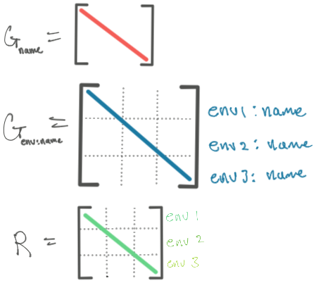

```{r setup, include=FALSE}
knitr::opts_chunk$set(echo = TRUE, cache = TRUE)
library(lattice)
library(lme4)
library(nlme)
library(glmmTMB) # template model builder, designed as improved glmmADMB
library(sommer) # asREML replacement
library(afex) # easy anova
library(emmeans)

library(broom.mixed) # clean mixed model outputs
library(kableExtra) # for tables
library(tidyverse)
```


<div class="bg-info">

> The following document is a work in progress!

</div>


# Introduction

Using random effects into the modeling equation gives us an opportunity to account for correlations among observations in a structured manner. Having a lot of flexibility in modeling a covariance structure is generally a pretty computationally difficult problem, but modern software have made this problem rather manageable. There are many numerical methods of solving the same equations, and thus a wide array of software to consider. Given the numerical complexity of the problem, the software will often times give different estimates and standard errors. 

The example that we use throughout this section is a [multi-environment potato RCBD](https://rdrr.io/cran/sommer/man/DT_example.html) (`DT_example` from the `sommer` package). The covariates in the dataset are: 

* `Name` - the genotype of potato plant
* `Env` - location/year combination.
* `Block` - coded uniquely across the environments
* `Yield` - a response, the number of potatoes from the plant
* `Weight` - another response, weight of the potatoes, to illustrate multiple trait experiments

```{r}
data(DT_example) # library(sommer)
```

```{r fig.height = 7, fig.width = 8, class.source = 'fold-hide'}
DT_example %>% ggplot(aes(Name, Yield)) +
  geom_point() + 
  facet_grid(Env~.) +
  theme_light(base_size = 13) +
  theme(axis.text.x = element_text(angle = 45, vjust = 1, hjust = 1)) + 
  labs(title = "Multi-Environment Potato Trial")
```

# Theory

**Under construction**

# Ecosystem Overview {.tabset}

The R packages that can do forms of variance covariance structures (not an exhaustive list):


```{r results = "asis", echo = FALSE}
eco_var_tbl <- 
  tribble(~package, ~commercial, ~link, ~estimation, ~`my rating`,
          "glmmTMB", "Free", "https://cran.r-project.org/web/packages/glmmTMB/index.html", "ML, REML (AD)", "★★",
          "sommer", "Free", "https://cran.r-project.org/web/packages/sommer/", "ML and REML (NR, AI, EMMA)", "★★★★",
          "lme4", "Free", "https://cran.r-project.org/web/packages/lme4/", "ML and REML (Iterative PLS)", "★",
          "nlme", "Free", "https://cran.r-project.org/web/packages/nlme/", "ML and REML (EM -> NR)", "★★★★",
          "SAS", "Paid", "https://documentation.sas.com/doc/en/statcdc/14.2/statug/statug_mixed_details01.htm", "ML, REML and MOM (MIVQUE0 -> W Transformation Sweep)", "★★★",
          "AS-REML", "Paid", "https://vsni.co.uk/software/asreml-r", "REML (AI)", "??",
          "emmREML", "Free", "https://cran.r-project.org/web/packages/EMMREML/index.html", "EMMA", "??")

names(eco_var_tbl)[grep("estimation", names(eco_var_tbl))] <- paste0("estimation", footnote_marker_number(2, "html"))
names(eco_var_tbl)[grep("my rating", names(eco_var_tbl))] <- paste0("my rating", footnote_marker_number(1, "html"))
eco_var_tbl %>% 
  mutate(software = cell_spec(package, "html", link = link), 
                       .keep="unused", .before = 1) %>%
  kbl(escape = FALSE) %>% 
  kable_paper(full_width=F) %>% 
  kable_styling(bootstrap_options = c("hover", "condensed")) %>% 
  footnote(number = c("?? means I haven't tried the software", "AI = Average Information, AD = Automatic Differentiation, NR = Newton Rapheson, EMMA = Efficient Mixed Model Association, EM = Expectation-Maximization, MOM = Method of Moments; "))
```

The ratings are rather subjective, based on stability, ease of use, flexibility and target applications. Personally, the order in which I would use the software (and what I recommend to others) would be:
* emmREML - implements the mixed model association, mentioned above.

1. nlme
2. SAS (proc MIXED)
3. glmmTMB
4. sommer

`nlme` will offer many options of variance structure with similar performance if you need more flexibility, but does not deal with crossed random effects. SAS has a very intuitive interface for specifying the "G"-side and "R"-side and will likely be able to handle your use case. glmmTMB also has a very intuitive syntax, mostly following lme4 syntax, but currently the "R"-side modeling is kind of hackish and a workaround (sets the residual error to something very small). sommer I think is the newest package, and thus the components of design are still settling. It is by far the most flexible for variance structure designs, and targeted specifically to those working in multi-environment trails but I think the syntax does take some getting used to.


* sommer - takes an AS-REML approach to fitting the variance components. 

* glmmTMB ([R Package](https://cran.r-project.org/web/packages/glmmTMB/index.html)) ([Paper](https://journal.r-project.org/archive/2017/RJ-2017-066/RJ-2017-066.pdf)) - is primarily a glmm package that uses lme4 based formula syntax. It uses the r package `TMB` in the background, which is MLE based and uses Laplace approximations for integrating out random effects. 
* SAS ([Docs](https://documentation.sas.com/doc/en/statcdc/14.2/statug/statug_mixed_details01.htm)) ([paper](https://www.researchgate.net/publication/242913395_Computing_Gaussian_Likelihoods_and_Their_Derivatives_for_General_Linear_Mixed_Models)) - uses a sweep method on the REML and ML profiled likelihood. There's good discussion of the methods in their documentation.
* afex - reformulates the formula statement and uses lme4 in the background
* MCMCglmm - takes a bayesian simulation approach to mixed modeling
* INLA - Integrated Nested Laplacian Approximation

## nlme

nlme is a rather stable package with a lot of facilities to account for many different variance structures on both the "G"-side and the "R"-side.

See `?pdClasses` and `?varClasses` for functional variance modeling.

## sommer

You can probably think of sommer as the free version of AS-REML. It particularly specializes in multienvironment, and heterogenous variance structures.

The variance component specification is a little cryptic, but based mostly on hadamard matrix multiplication.

* `mmer`
  * `vsr` = "Variance Structure for Random effects", use this to build the variance, outer function
    * `dsr` = diagonal covariance structure
    * `usr` = unstructure covraince structure
* `mmec` - the main "average information" algorithm for solving
  * `vsc` = "variance structure for coefficients", `random=~vsc(e, f, h, g)` means var(g) = G.e @ G.f @ G.h @ I.g
    * `isc` = identity covariance structure
  

The numbering in the matrix means it's a constraint

0) not to be estimated
1) estimated and constrained to be positive (i.e. variance component)
2) estimated and unconstrained (i.e., normally a covariance)
3) not estimated but fixed (provided by `Gti` arg)

```{r}
x <- as.factor(c(1:5,2:6,1:5))
usr(x) # list(vector, vcov structure)
x <- as.factor(c(1:5,1:5,1:6))
csr(x, matrix(1, 6, 6))

```

```{r}
x <- as.factor(c(1:5,2:6,1:5))
dsr(x) # list(vector, vcov)
```

### Further Reading {.unlisted .unnumbered}

They overview their package in [this paper](https://journals.plos.org/plosone/article?id=10.1371/journal.pone.0156744#), and implement three programs for fitting: 

 * Newton Rapheson Direct Inversion
 * ["Average Information REML"](http://faculty.washington.edu/tathornt/BIOST551/articles_2012/AverageInformation.pdf) - original paper by same authors of the AS-REML package. A great example of this optimization step with an example is given in a book chapter by author of "sommer" package [Overview of Major Computer Packages for Genomic Prediction of Complex Traits](https://link.springer.com/protocol/10.1007/978-1-0716-2205-6_6)
  * ["Efficient Mixed Model Association (EMMA)"](https://academic.oup.com/genetics/article/178/3/1709/6061473?login=false)

## SAS

* [Tips and Strategies for Mixed Modeling with SAS](https://www.lexjansen.com/mwsug/2012/SA/MWSUG-2012-SA15.pdf)

## glmmTMB

The [glmmTMB variance covariance structures vignette](https://cran.r-project.org/web/packages/glmmTMB/vignettes/covstruct.html) has a lot of information.

# Examples

## Homogenous variance {.tabset}

<figure>
</img>
<figcaption></figcaption>
</figure>


### lme4

```{r}
# lmer approach
mmod1 <- lmer(Yield ~ Env + (1 | Name) + (1|Env:Name), data = DT_example)
# mmod1_alt <- lmer(Yield ~ Env + (1 | Name/Env), data = DT_example) # same way of specifying model identical results

# summary(mmod1_alt)
as.data.frame(VarCorr(mmod1))$vcov
 # Groups   Name        Std.Dev.
 # Env:Name (Intercept) 2.2745  
 # Name     (Intercept) 1.9188  
 # Residual             2.0895

# profiling for standard errors
pr_mmod1 <- profile(mmod1)
# xyplot (pr_mmod1 , aspect =1.3)
# splom(pr_mmod1)
# densityplot(pr_mmod1)

# taking the half the width of a .68 confidence interval as an estimate of a standard error of the estimate
confint(pr_mmod1, c(".sig01", ".sig02", ".sigma"), level = .68)^2 %>% # square for variance
  as.data.frame() %>%
  mutate(var_se_ish = (`84 %` - `16 %`) / 2)
```

### sommer

```{r}
# Univariate, homogenous variance models,
# for p > n
ans1r <- mmer(Yield ~ Env,
              random = ~ Name + Env:Name,
              rcov = ~ units, # residual structure
              data = DT_example, verbose = FALSE)
summary(ans1r)$varcomp
```

```{r}
# MME-based Average information, for records > coefficients?
ans1c <- mmec(Yield~Env,
              random= ~ Name + Env:Name,
              rcov= ~ units,
              data=DT_example, verbose = FALSE)
summary(ans1c)$varcomp
```


### nlme

```{r}
# lme method for fitting homogenous variance model, nested
lmod1 <- lme(Yield~Env,
             random = list(Name = pdSymm(form = ~1),
                           Env = pdSymm(form = ~1)),
             method = "REML",
             data = DT_example)

summary(lmod1)
```

### SAS

```{sas eval = FALSE}
# SAS example
proc mixed data=dt covtest;
class env name;
model yield = env;
random name name*env;
run;
```

* `covtest` - for the standard errors of covariance estimates

| Cov Parm | Estimate | Standard Error | Z-Value | Pr > Z |
|----------+----------+----------------+---------+--------|
| name     |   3.7861 |         1.6078 |    2.35 | 0.0093 |
| env*name |   5.1616 |         1.4675 |    3.52 | 0.0002 |
| Residual |   4.3678 |         0.6477 |    6.74 | <.0001 |

Table: SAS output, homogenous variance

### glmmTMB

```{r}
tmod1 <- glmmTMB(Yield ~ Env + (1 | Name) + (1 | Env:Name), 
                 REML = TRUE,
                 data = DT_example)
summary(tmod1)
```

## {- .unlisted .unnumbered}

### Comparison {.unlisted .unnumbered}

The results with lmer are quite close, but the effect from average information is quite different. The conclusion should be that even for simple models, the numerical differences of the variances can be quite different depending on the optimization algorithm.


## Heterogeneous G, homogenous R {.tabset}

This is an example of heterogenous VC effects for G2, and still identity for R.

<figure>
</img>
<figcaption></figcaption>
</figure>

### lme4

You can force `lmer` to fit several random effects by expanding the variable to be a dummy variable

```{r}
DT_lmer <- bind_cols(DT_example,
                     model.matrix(~0 + Env, data=DT_example))
DT_lmer %>% names()

mmod2 <- lmer(Yield ~ Env + (1|Name) + (0 + EnvCA.2011 + EnvCA.2012 + EnvCA.2013 || Name), 
              data = DT_lmer)

summary(mmod2)
```


### sommer

```{r}
ans2r <- mmer(Yield~Env,
              random= ~Name + vsr(dsr(Env),Name), # the second one is an interaction term, and specifies
              rcov= ~units,
              data=DT_example, verbose = FALSE)

summary(ans2r)$varcomp
```


```{r}
ans2e <- mmec(Yield~Env,
              random = ~Name + vsc(dsc(Env), isc(Name)),
              rcov = ~units,
              data = DT_example,
              verbose = FALSE)
summary(ans2e)$varcomp
```

### glmmTMB

```{r}
# glmmTMB
tmod2 <- glmmTMB(Yield ~ Env + (1|Name) + diag(Env+0|Name), # just for more intuitive summary results, (changes interpretation of covariance paramters)
                 data = DT_example,
                 REML = TRUE)
summary(tmod2)
```

### nlme

```{r}
# lme method of fitting heterogenous variance structure
lmod2 <- lme(Yield ~ Env,
             random = list(Name = pdBlocked(
               list(pdIdent(~1), # Identity for Name
                    pdDiag(~Env-1)))), # Diagonal structure for Environment:Name
             method = "REML",
             data = DT_example)

VarCorr(lmod2) # Nice, they match!
summary(lmod2)
```

### afex

```{r}
set_default_contrasts()
amod2 <- mixed(Yield ~ Env + (1|Name) + (0 + Env || Name),
      data = DT_example,
      check_contrasts = FALSE,
      expand_re = TRUE)
summary(amod2)
```


### SAS

```{sas eval = FALSE}
# SAS
proc mixed data=dt;
class env name;
model yield = env;
random name / G;
random name*env / group = env;
run;
```


## Heterogenous G and R {.tabset}

Also called a Heterogeneous CS model.

<figure>
</img>
<figcaption></figcaption>
</figure>

### sommer

```{r}
ans3r <- mmer(Yield~Env,
              random= ~Name + vsr(dsr(Env),Name), # the second one is an interaction term, and specifies
              rcov= ~vsr(dsr(Env),units),
              data=DT_example, 
              verbose = FALSE)

sqrt(summary(ans3r)$varcomp$VarComp)
summary(ans3r)$varcomp %>% mutate(sdComp = sqrt(VarComp),
                                  .after = VarComp)
```

```{r}
# Apparently order of your data matters, and can result in an error message of not fitting... can't find documentation as to why.
DT <- DT_example[with(DT_example, order(Env)), ]

ans3e <- mmec(Yield~Env,
              random = ~Name + vsc(dsc(Env), isc(Name)),
              rcov = ~vsc(dsc(Env), isc(units)),
              data = DT, # DT_example here will result in failure...
              verbose = FALSE)
summary(ans3e)$varcomp
```

### nlme

```{r}
# lme example with heterogenous G and R
lmod3 <- lme(Yield ~ Env,
             random = list(Name = pdBlocked(list(
               pdIdent(form = ~1), # Name
               pdDiag(form = ~Env-1)))), # Name:Env
             weights = varIdent(form = ~1 | Env),
             method = "REML",
             data = DT_example)

summary(lmod3)
VarCorr(lmod3)

sigma_hat <- summary(lmod3)$sigma # for some reason, defaults to CA.2012 for the "reference" sigma
sigma_weights <- coef(lmod3$modelStruct$varStruct, unconstrained=FALSE) # extract the weights estimated for each Env
c(CA.2012 = sigma_hat, sigma_hat*sigma_weights)^2 # Multiply reference sigma to weights for final sd estimates (square for variance)

intervals(lmod3) # for the approximate confidence intervals
```

```{r}
# picked A01143-3C because it is present in all 3 environments
getVarCov(lmod3, type = "random.effects") # G
getVarCov(lmod3, individuals = "A01143-3C", type = "conditional") # R 
getVarCov(lmod3, individuals = "A01143-3C", type = "marginal") # ZGZ + R
```

### glmmTMB

```{r warning = FALSE}
# glmmTMB workaround for heterogenous R, need to code individual units as factor
DT_TMB_example <- DT_example %>% mutate(units = as.factor(1:n()))

# gives "false convergence warning": https://cran.r-project.org/web/packages/glmmTMB/vignettes/troubleshooting.html
# tough to diagnose
tmod3 <- glmmTMB(Yield ~ Env + (1|Name) + diag(Env + 0 | Name) + diag(Env + 0 | units), 
                 dispformula = ~0,
                 REML = TRUE,
                 data = DT_TMB_example)

# update the optimizer method
tmod3_bfgs <- update(tmod3, control = glmmTMBControl(optimizer = optim,
                                                     optArgs = list(method="BFGS")))

# extract variance components
tmod3_bfgs %>% tidy(effects = "ran_pars") %>% 
  filter(startsWith(term, "sd")) %>% 
  separate(term, into = c("term", "partition"), sep = "__") %>% 
  mutate(var_est = estimate^2) %>% 
  dplyr::select(group, partition, var_est)
```

### SAS

```{sas eval = FALSE}
proc mixed data=dt;
class env name;
model yield = env;
random name;
random name*env / group = env;
repeated / group = env;
run;
```


| Cov      | Parm | Group    | Estimate |
|----------+------+----------+----------|
| name     |      |          |   3.0647 |
| env*name | env  | "CA.2011 |  10.0346 |
| env*name | env  | "CA.2012 |   1.8875 |
| env*name | env  | "CA.2013 |   6.5388 |
| Residual | env  | "CA.2011 |   4.9424 |
| Residual | env  | "CA.2012 |   5.7143 |
| Residual | env  | "CA.2013 |   2.5599 |

Table: SAS output for above code

## Unstructured G, Heterogenous R {.tabset}

<figure>
</img>
<figcaption></figcaption>
</figure>

### sommer

```{r}
ans4r <- mmer(Yield~Env,
              random=~ vsr(usr(Env), Name), # we drop name from the model just for illustration (too many variables)
              rcov=~vsr(dsr(Env),units),
              data=DT_example, verbose = FALSE)

summary(ans4r)$varcomp
```

```{r}
# Display the Variance components as a matrix
G_vec <- summary(ans4r)$varcomp %>% slice(1:6) %>% pull(VarComp)
G <- Matrix(0,
            nrow = 3,
            ncol = 3)
G[upper.tri(G, diag = TRUE)] <- G_vec
colnames(G) <- c("CA.2011", "CA.2012", "CA.2013")
rownames(G) <- c("CA.2011", "CA.2012", "CA.2013")
G
```

### nlme

```{r}
# lme version. Note we dropped "Name" from the model here because otherwise the std error of the variance estimates were HUGE. checked with interval(lmod4)
lmod4 <- lme(Yield ~ Env,
             random = list(Name = pdSymm(form = ~Env-1)), # Name:Env
             weights = varIdent(form = ~1 | Env),
             method = "REML",
             data = DT_example)
getVarCov(lmod4) # G, now that we specify the same likelihood, the answers are the same
getVarCov(lmod4, individual = "A01143-3C",type = "conditional") # R
# summary(lmod4)
```

```{r eval = FALSE}
# manual way of extracting the weights and multiplying by sigma for the residual variance components.
# lmod4$modelStruct$varStruct # The variance structure of the residuals is in this object
vw <- 1 / varWeights(lmod4$modelStruct$varStruct) # accessor function gives weights, which is inverse of sigma multiplier
(vw[!duplicated(vw)] * lmod4$sigma)^2 # deduplicate, then multiply by sigma for variance
```

### glmmTMB

```{r}
## glmmTMB
tmod4 <- glmmTMB(Yield ~ Env + us(Env + 0 | Name) + diag(Env + 0 | units), # drop name for estimability...
                 dispformula = ~0,
                 REML = TRUE,
                 data=DT_TMB_example)
summary(tmod4)


# tmb_sd <- vcov(tmod4,full=TRUE) %>% diag() %>% `[`(4:12) %>% sqrt()
# tmb_logsd <- tmod$sdr$par.fixed[2:5]
# tmb_logsd <- tmb_logsd[c(1, 2, 3, 1, 2, 3, 4, 4, 4)]
# tmb_sd*2*exp(2*tmb_logsd)
# 
# sqrt(2*exp(tmod4$sdr$par.fixed * 2))
# confint(tmod4, component = "all", parm = c(1, 2, 3, 4, 5))
# glmmTMB:::confint.glmmTMB(tmod4,parm="theta_")
```


## Multivariate, Homogenous variance models {.tabset}

### sommer

```{r}
ans5r <- mmer(cbind(Yield, Weight) ~ Env,
              random= ~ vsr(Name, Gtc=unsm(2)),
              rcov= ~ vsr(units, Gtc=diag(2)),
              data=DT_example, verbose = FALSE)
summary(ans5r)$varcomp
```


# Additional Resources

Right now these resources are relatively unorganized, but contain a wealth of information. It seems like the variance modeling is scattered throughout the packages in R.

- [Factor Specific Variances](https://rpubs.com/bbolker/factorvar) - gives example of "G" side and "R" side for heterogeneous variance modeling. There is a correct way and incorrect way to specify this. Both are heterogeneous variance component style matrices.
- [Covariance Structures in R](https://rpubs.com/samuelkn/CovarianceStructuresInR) - messier overview of "G" and "R" side matrix structuring, however breaks down the examples quite well in terms of how to actually specify the model that we'd like.
- [Overview of Major Computer Package for Genomic Prediction of Complex Traits](https://link.springer.com/protocol/10.1007/978-1-0716-2205-6_6) - author of the sommer package, excellet overview of the ecosystem and a worked example of reml estimation with variance structures.
- [MMFAIR Heterogenous Error Variance](https://schmidtpaul.github.io/MMFAIR/heterogeneous_error_variance.html) - a nice rmarkdown description of a lot of different error structures, with code in sommer, nlme, lme4, SAS

For more of a philosophical take on confirmatory analyses:

* [Random effects structure for confirmatory hypothesis testing: Keep it maximal](https://www-sciencedirect-com.ezproxy.library.wisc.edu/science/article/pii/S0749596X12001180?via%3Dihub#b0210) - argues that for confirmatory analyses, should use the most random effects possible that make sense for the design.

