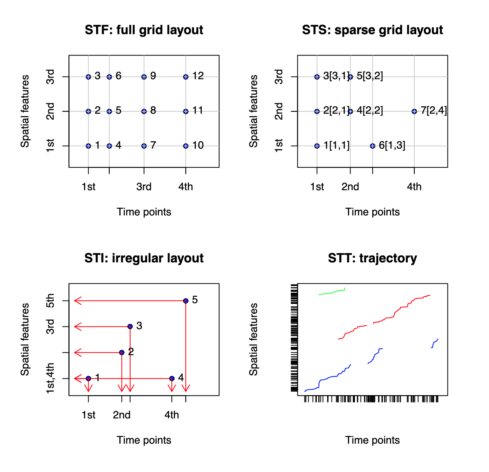

```{r setup, include=FALSE}
knitr::opts_chunk$set(echo = TRUE, cache = TRUE)
library(tidyverse)
library(cowplot) # assembling multiple graphs
library(sp)
library(ggspatial)
library(SpatialEpi) # needed for scottish lip cancer study
library(leaflet) # interactive mapping
library(INLA) # for inference modeling and fitting
library(spdep) # spatial dependency functions
library(rgdal) # for reading shapefiles
library(sf) # general shapefiles
library(gghighlight) # highlight one line in ggplot
library(MASS) # for mvrnorm or cholesky factors
library(IDE) # Itero Differential Equation
library(FRK) # for distance function, stands for Fixed-Rank Kriging
library(plyr) # for data manipulation
library(expm) # raising matrices to specified powers
library(spacetime)
library(CARBayes)
library(CARBayesdata)
library(GGally)

# devtools::install_github("andrewzm/STRbook")
library(STRbook) # Accompanying code for Spatio-Temporal statistics with R book

# `rgeos` needed by leaflet
```

# Spatial Classes

Has slots for `bbox` which are the spatial extents, and a `CRS` object for the coordinate reference system.

```{r}
getClass("Spatial")
getClass("CRS")
```

```{r}
# Example instantiation
bb <- matrix(c(30, 85, 300, 90), ncol = 2, dimnames = list(NULL,c("min", "max")))
crs <- CRS("+proj=longlat")
Spatial(bb, crs)
```

## Spatial Points

Class `SpatialPoints` adds a `coords` slot to `Spatial`

```{r}
getClass("SpatialPoints")
```

```{r}
# example instantiation
cran <- read.table("data/CRAN051001a.txt", header = TRUE)
cran_mat <- cbind(cran$long, cran$lat)

llcrs <- CRS("+proj=longlat +ellps=WGS84")
cran_sp <- SpatialPoints(cran_mat, proj4string = llcrs)
summary(cran_sp)
```

```{r}
# accessor methods
coordinates(cran_sp)[which(cran$loc == "Brazil"),] # index coordinates
bbox(cran_sp) # bounding box
summary(cran_sp[which(cran$loc == "Brazil"), ]) # can index class directly, new bbox.
```

## SpatialPointsDataFrame

Used for matching coordinates with other covariates, like name of coordinate. Needs to have matching row names. Objects are meant to operate like dataframes.

```{r}
# matches by rownames
row.names(cran_mat) <- 1:nrow(cran)
# cran %>% row.names() # matches

cran_spdf <- SpatialPointsDataFrame(cran_mat, cran, proj4string = llcrs, match.ID = TRUE)
summary(cran_spdf) # meant to
```

```{r}
# alternate way, just attach coordinates and proj4string by assignment
cran_spdf_alt <- cran
# coordinates(cran_spdf_alt) <- c("long", "lat") # can select out columns if already in dataframe
coordinates(cran_spdf_alt) <- cran_mat # coordinates as matrix
proj4string(cran_spdf_alt) <- llcrs # crs
summary(cran_spdf_alt) # Turns it into a SpatialPointsDataFrame by assigning coordinate/proj
```

## spacetime package

The spacetime package provides dataframes for certain types of spatial data.



- `STFDF`

```{r}
getClass("ST")
```


```{r}
# Inheritance
```


# Conditional AutoRegressive Model

## Examples

### Glasgow Prices (Spatial CAR)

This example is the vignette for CARBayes, another packages that allows spatial modeling of this kind. This example is taken from [Th CARBayes Vignette](https://cran.r-project.org/web/packages/CARBayes/vignettes/CARBayes.pdf)

```{r}
data(pricedata)
data(GGHB.IZ)

pricedata <- pricedata %>% mutate(logprice = log(pricedata$price))

ggpairs(data = pricedata, columns = c(8, 3:7))
```


```{r}
# merge price 
pricedata.sf <- merge(x=GGHB.IZ, y=pricedata, by="IZ", all.x=FALSE)
pricedata.sf <- st_transform(x=pricedata.sf,
                             crs='+proj=longlat +datum=WGS84 +no_defs')

library(leaflet)
colours <- colorNumeric(palette = "YlOrRd", domain = pricedata.sf$price)
map1 <- leaflet(data=pricedata.sf) %>% 
  addTiles() %>% 
  addPolygons(fillColor = ~colours(price), color = "", weight = 1,
              fillOpacity = .7) %>% 
  addLegend(pal = colours, values = pricedata.sf$price, opacity = 1,
            title = "price") %>% 
  addScaleBar(position="bottomleft")
map1
```

#### The Nonspatial modeling approach

```{r}
glasgow_lm <- lm(logprice~crime+rooms+sales + factor(type) + driveshop, data = pricedata.sf)
glasgow_lm %>% summary()
```

```{r}
W.nb <- poly2nb(pricedata.sf, row.names = pricedata.sf$IZ)
W.list <- nb2listw(W.nb, style = "B") # binary coding, just 1 if they are a neighbor
moran.mc(x = residuals(glasgow_lm), listw=W.list, nsim = 1000)
```

#### Spatial Modeling

The models here are no different, but I'm still having a hard time understanding the parameters that are estimate
```{r}
W <- nb2mat(W.nb, style = "B")
chain1 <- S.CARleroux(logprice~crime+rooms+sales + factor(type) + driveshop, data = pricedata.sf, family="gaussian", W=W, burnin = 100000, n.sample=300000, thin=100)
chain2 <- S.CARleroux(logprice~crime+rooms+sales + factor(type) + driveshop, data = pricedata.sf, family="gaussian", W=W, burnin = 100000, n.sample=300000, thin=100)
chain3 <- S.CARleroux(logprice~crime+rooms+sales + factor(type) + driveshop, data = pricedata.sf, family="gaussian", W=W, burnin = 100000, n.sample=300000, thin=100)
```


### Scotland Lip Cancer (Spatial CAR)

This section follows the tutorial from [Geospatial Health Data: Modeling and Visualization with R-INLA and Shiny](https://www.paulamoraga.com/book-geospatial/sec-arealdataexamplespatial.html)

```{r}
data("scotland")

# getClass("SpatialPolygons") # has polygons, plotOrder, bbox, proj4string
# slotNames(map) # getting the value names of the object itself
map <- scotland$spatial.polygon
plot(map) # class SpatialPolygons

```

The map is in the projection OSGB 1936/British National Grid which has EPSG code 27700. The proj4 string of this projection can be seen in https://spatialreference.org/ref/epsg/27700/proj4/ or can be obtained with R as follows:

```{r}
codes <- rgdal::make_EPSG()
codes[which(codes$code == "27700"), ]
```

```{r}
# assign 
proj4string(map) <- "+proj=tmerc +lat_0=49 +lon_0=-2 +k=0.9996012717 +x_0=400000 +y_0=-100000 +datum=OSGB36 +units=km +no_defs"

# reproject into WGS84 for leaflet
map <- spTransform(map, CRS("+proj=longlat +datum=WGS84 +no_defs"))
```

Data preparation 

- `county`: id of each country
- `Y`: observed number of lip cancer cases in each county
- `E`: expected number of lip cancer cases in each county
- `AFF`: proportion of population in agriculture, fishing and forestry
- `SIR`: standardized incidence ratio

```{r}
# prepare the dataset and calculate SIR
d <- scotland$data[,c("county.names", "cases", "expected", "AFF")]
names(d) <- c("county", "Y", "E", "AFF")
d$SIR <- d$Y / d$E # observed over expected

# prepare SpatialPolygonsDataFrame, SpatialPolygons + Data basically
rownames(d) <- d$county # set rownames to county for matching later
# getClass("SpatialPolygonsDataFrame") # just adds "data" slot to SpatialPolygons
map <- SpatialPolygonsDataFrame(map, d, match.ID = TRUE) # make Object for leaflet

```

```{r}
l <- leaflet(map) %>% addTiles()

# domain gives possible values to be mapped, returns function
pal <- colorNumeric(palette = "YlOrRd", domain = map$SIR)

# Create the tooltip label
labels <- sprintf("<strong> %s </strong> <br/>
  Observed: %s <br/> Expected: %s <br/>
  AFF: %s <br/> SIR: %s",
  map$county, map$Y, round(map$E, 2),
  map$AFF, round(map$SIR, 2)
) %>%
  lapply(htmltools::HTML)

l %>%
  addPolygons(
    color = "grey", weight = 1, # the outlines
    fillColor = ~ pal(SIR), fillOpacity = 0.5, # how to fill the shapes
    highlightOptions = highlightOptions(weight = 4), # thicker outline on hover
    label = labels, # the tooltip label
    labelOptions = labelOptions( # some general options for the labels
      style = list(
        "font-weight" = "normal",
        padding = "3px 8px"
      ),
      textsize = "15px", direction = "auto"
    )
  ) %>%
  # legend in bottom right
  addLegend(
    pal = pal, values = ~SIR, opacity = 0.5,
    title = "SIR", position = "bottomright"
  )
```


For the modeling piece, we model with CAR,

$$
\begin{aligned}
Y_i &\sim Poisson(E_i \theta_i), i = 1,\dots , n \\
\log(\theta_i) &= \beta_0 + \beta_1 \times AFF_i + u_i + v_i
\end{aligned}
$$
- $E_i$ is expected count
- $\theta_i$ is relative risk in area $i$
- $AFF_i$ is the fishing/farming covariate
- $u_i$ is spatial component with conditional guassian model, we assum $u_i|\mathbf{u_{-i}} \sim N(\bar u_{\delta_i}, \frac{\sigma^2_u}{n_{\delta_i}})$
- $v_i$ is unstructured spatial effect


```{r}
# create neighborhood matrix from scottish data

nb <- poly2nb(map) # "nb" class

head(nb) # just a list of neighbors by node
nb # printing shows some summary statistics of the dataset, as well as "disconnected regions" with no neighbors
# nb2mat(nb, style="B",zero.policy=T) # convert to an adjacency matrix
```

Can calculate the Moran's I, allows testing of spatial autocorrelation in the data, defined as 

$$
\begin{equation}
I = \frac{n}{\sum_{i=1}^{n}\sum_{j=1}^{n}w_{ij}}
\frac{\sum_{i=1}^{n}\sum_{j=1}^{n}w_{ij}(x_i-\bar{x})(x_j-\bar{x})}{\sum_{i=1}^{n}(x_i - \bar{x})^2}
\end{equation}
$$

- $w_{ij}$ is weight of neighborhood incidence
- $x_i$ is covariate at area $i$.

```{r}
set.ZeroPolicyOption(TRUE) # setting globally, in argument it didn't work
nb_W <- nb2listw(nb, style = "W")
nb_global <- Szero(nb_W) # get global sum of weights

# direct calculation of the statistic
moran(x =map$SIR, 
      listw = nb_W,
      n = length(map$SIR),
      S0 = nb_global)

moran.plot(map$SIR, nb_W) # upper right and lower left are positively correlated, slope is ~ approximately the moran statistic
moran.mc(map$SIR, nb_W, 100) # Lots of spatial correlation, randomization test.
```

Not quite sure how to interpret this plot, 


```{r}
# transfer the neighbors object to INLA
nb2INLA("output/map.adj", nb) # export to file, in INLA format
g <- inla.read.graph(filename = "output/map.adj") # read the .adj file for INLA
```


```{r}
# indices for random effects u, v
map$idareau <- 1:nrow(map@data) # u
map$idareav <- 1:nrow(map@data) # v

# f() denotes random effect, "besag"
formula <- Y ~ AFF +
  f(idareau, model = "besag", graph = g, scale.model = TRUE) + # spatial dependence
  f(idareav, model = "iid") # unstructured noise

# fit the formual
res <- inla(formula, # formula from above
  family = "poisson", # log link
  data = map@data, # the data file
  E = E, # "Known component in the mean for the Poisson likelihoods defined as E exp(eta)" see docs
  control.predictor = list(compute = TRUE)) # compute posteriors of predictions

summary(res) # output
```
The results are pretty standard for interpretation, we can get marginals of the parameters (`AFF`) with smoothed (spline) marginals

```{r}
# results has an output of marginals for each of the fixed effects, on some grid

# plot(res$marginals.fixed$AFF)
# lines(marginal$x, marginal$y)

marginal <- inla.smarginal(res$marginals.fixed$AFF) # smoothed marginals
marginal <- data.frame(marginal)
ggplot(marginal, aes(x = x, y = y)) + geom_line() +
  labs(x = expression(beta[1]), y = "Density") +
  geom_vline(xintercept = 0, col = "black") + theme_bw()
```

Each fitted value for each of the counties can be extracted from the summaries.

```{r}
head(res$summary.fitted.values)
```

final version of the leaflet map, with relative risk, and 95% CI for RR.

```{r}
# Add to map df data
map$RR <- res$summary.fitted.values[, "mean"]
map$LL <- res$summary.fitted.values[, "0.025quant"]
map$UL <- res$summary.fitted.values[, "0.975quant"]

# Leaflet code 
pal <- colorNumeric(palette = "YlOrRd", domain = map$RR)

labels <- sprintf("<strong> %s </strong> <br/>
  Observed: %s <br/> Expected: %s <br/>
  AFF: %s <br/> SIR: %s <br/> RR: %s (%s, %s)",
  map$county, map$Y, round(map$E, 2),
  map$AFF, round(map$SIR, 2), round(map$RR, 2),
  round(map$LL, 2), round(map$UL, 2)
) %>% lapply(htmltools::HTML)

lRR <- leaflet(map) %>%
  addTiles() %>%
  addPolygons(
    color = "grey", weight = 1, fillColor = ~ pal(RR),
    fillOpacity = 0.5,
    highlightOptions = highlightOptions(weight = 4),
    label = labels,
    labelOptions = labelOptions(
      style =
        list(
          "font-weight" = "normal",
          padding = "3px 8px"
        ),
      textsize = "15px", direction = "auto"
    )
  ) %>%
  addLegend(
    pal = pal, values = ~RR, opacity = 0.5, title = "RR",
    position = "bottomright"
  )
lRR
```

```{r}
# exceedence probabilities, cut offs for action
# P(\theta_i > c), probability that a specific area i has relative risk higher than some threshold.
sapply(res$marginals.fitted.values, FUN = function(marg){1 - inla.pmarginal(q = 2, marginal = marg)})
```

### Lung Cancer Iowa (spatio-temporal modeling)

Had to pull the data directly from the archived package, it seems to have been taken off CRAN because the contact author is no longer active. [Link to Archive](https://cran.r-project.org/src/contrib/Archive/SpatialEpiApp/)

```{r}
dohio <- read.csv("data/dataohiocomplete.csv")
head(dohio)


map <- as_Spatial(st_read("data/fe_2007_39_county", layer="fe_2007_39_county")) # read shape files, not quite, then convert to Spatial for sp methods
plot(map)
```

```{r}
# observed cases
d <- aggregate(
  x = dohio$y,
  by = list(county = dohio$NAME, year = dohio$year),
  FUN = sum
)
names(d) <- c("county", "year", "Y")
head(d)

# reorder correctly,
dohio <- dohio[order(
  dohio$county,
  dohio$year,
  dohio$gender,
  dohio$race
), ]

# check sorting
# dohio[1:20, ]

# 2 race x 2 gender
n.strata <- 4
E <- expected( # function needs sorted data
  population = dohio$n,
  cases = dohio$y,
  n.strata = n.strata
)
nyears <- length(unique(dohio$year)) # number of years
countiesE <- rep(unique(dohio$NAME), # county vector
                 each = nyears)

ncounties <- length(unique(dohio$NAME))
yearsE <- rep(unique(dohio$year), # rep by counties
              times = ncounties)

# putting it all together
dE <- data.frame(county = countiesE, 
                 year = yearsE,
                 E = E)
head(dE)

# put it back into the main dataset
d <- merge(d, dE, by = c("county", "year"))
head(d)

# calc SIR
d$SIR <- d$Y / d$E
head(d)

# reshape into lengthwise file with rows as counties and columns as years
dw <- reshape(d,
  timevar = "year",
  idvar = "county",
  direction = "wide"
)

map <- merge(map, dw, by.x = "NAME", by.y = "county")

map_sf <- st_as_sf(map) # into sf for ggplot
map_sf <- gather(map_sf, year, SIR, paste0("SIR.", 1968:1988)) # longwise data now
map_sf$year <- as.integer(substring(map_sf$year, 5, 8)) # just get the year string

# make plot
ggplot(map_sf) + 
  geom_sf(aes(fill = SIR)) + # map the shapefiles 
  facet_wrap(~year, dir = "h", ncol = 7) +
  ggtitle("SIR") + theme_bw() +
  theme(
    axis.text.x = element_blank(),
    axis.text.y = element_blank(),
    axis.ticks = element_blank()
  ) +
  scale_fill_gradient2(
    midpoint = 1, low = "blue", mid = "white", high = "red"
  )
```

```{r}
ggplot(d, aes(x = year, y = SIR, 
                   group = county, color = county)) +
  geom_line() + geom_point(size = 2) + theme_bw() +
  theme(legend.position = "none") +
  gghighlight(county == "Adams")
```

Now we actually model the data with a spatio-temporal component

```{r}
nb <- poly2nb(map) # convert to adjmat
nb2INLA("data/map_ohio.adj", nb)
g <- inla.read.graph(filename = "data/map_ohio.adj")

d$idarea <- as.numeric(as.factor(d$county))
d$idarea1 <- d$idarea # make copy of the idarea, becuase two terms with spatial random componenet, but in INLA, only one variable can be associated to the `f()` at a time.
d$idtime <- 1 + d$year - min(d$year) # index years/dates from 1

# for documentation of how this matches with model
# inla.doc(what = "bym")
formula <- Y ~ f(idarea, model = "bym", graph = g) + # spatial component
  f(idarea1, idtime, model = "iid") + # time x area interaction
  idtime # global trend across time

res <- inla(formula,
  family = "poisson", 
  data = d, 
  E = E,
  control.predictor = list(compute = TRUE)
)
```

```{r}
summary(res)
```
It's hard to interpret these

```{r}
# plot with RR values
d$RR <- res$summary.fitted.values[, "mean"]
d$LL <- res$summary.fitted.values[, "0.025quant"]
d$UL <- res$summary.fitted.values[, "0.975quant"]

map_sf <- merge(
  map_sf, d,
  by.x = c("NAME", "year"),
  by.y = c("county", "year")
)

ggplot(map_sf) + geom_sf(aes(fill = RR)) +
  facet_wrap(~year, dir = "h", ncol = 7) +
  ggtitle("RR") + theme_bw() +
  theme(
    axis.text.x = element_blank(),
    axis.text.y = element_blank(),
    axis.ticks = element_blank()
  ) +
  scale_fill_gradient2(
    midpoint = 1, low = "blue", mid = "white", high = "red"
  )
```

# Dynamic Spatio Temporal Statistical Models

This exposition follows _Spatio-Temporal Statistics With R (Wikle, Zammit-Mangion, Cressie)_

## Examples

### 1D (IDE)

This example assumes the Itero-Differential Equation (IDE) is given, and we will show how to simulate from a given IDE. The ID we consider is

$$
\begin{aligned}
Y_t(s) = \int_{D_s} m(s, x; \mathbf{\theta_p})Y_{t-1}(x)\,dx + \eta_t(s), \quad s,x\in D_s
\end{aligned}
$$

- $Y_t(s)$ is the spatio-temporal process at time $t$,
- $m(s,x;\mathbf{\theta_p})$ - is called the transition kernel, and governs the dynamics of the process
- $\theta_p$ are the parameters, normally estimated, but we fix them for now.
- $\eta_t(\cdot)$ is a spatial process.

```{r}
set.seed(1)

# create grid for simulation, (between 0,1)

ds <- 0.01 # step for spatial grid
s_grid <- seq(0, 1, by = ds) # spatial grid
N <- length(s_grid)
```

```{r}
nT <- 201 # number of time points
t_grid <- 0:(nT-1) # time grid
st_grid <- expand.grid(s = s_grid, t = t_grid) # space-time grid
```


```{r}
m <- function(x, s,thetap) {
 gamma <- thetap[1]             # amplitude
 l <- thetap[2]                 # length
 offset <- thetap[3]            # offset
 D <- outer(s + offset, x, "-") # displacements
 gamma * exp(-D^2/l)            # kernel eval.
}
```

```{r}
# see how the parameterization differs for a few
thetap <- list()
thetap[[1]] <- c(40, 0.0002, 0) # narrow, centered.
thetap[[2]] <- c(5.75, 0.01, 0) # wider
thetap[[3]] <- c(8, 0.005, 0.1) # shifted right
thetap[[4]] <- c(8, 0.005, -0.1) # shifted left
```

```{r}
m_x <- m(s=0.5, x = s_grid,
         thetap=thetap[[1]]) %>% 
  as.numeric()
df <- data.frame(x=s_grid, m = m_x)

# plot the data
ggplot(df) + 
  geom_line(aes(x,m)) +
  theme_bw() 
```

```{r}
# The covariance of the spatial noise
# Simulate from Multivariate Normal, by cholesky decomp of the covariance
Sigma_eta <- 0.1 * exp( -abs(outer(s_grid, s_grid, '-') / 0.1))

L <- t(chol(Sigma_eta)) # chol() returns upper Cholesky factor
sim <- L %*% rnorm(nrow(Sigma_eta)) # simulate realization of eta

qplot(s_grid, sim, geom = "line") +
  theme_minimal() +
  labs(title = "realization of a random spatial process in 1d")
```

```{r}
Y <- list()

# outer loop does 4 kernels
for(i in 1:4) {
  M <- m(s_grid, s_grid, thetap[[i]]) # create kernel function
  
  
  Y[[i]] <- data.frame(s = s_grid, # initialize grid and process
                       t = 0,
                       Y = 0)
  # for each timepoint
  for (j in t_grid[-1]) {
    prev_Y <- filter(Y[[i]], t == j - 1)$Y # get Y at t-1
    eta <- L %*% rnorm(N) # simulate eta
    
    new_Y <- (M %*% prev_Y * ds + eta) %>% as.numeric() # euler approximation, approximating integral with sum
    
    Y[[i]] <- rbind(Y[[i]],
                    data.frame(s = s_grid,
                               t = j,
                               Y = new_Y))
  }
}
```


```{r}
hovmoller_plot <- function(idx) {
  ggplot(Y[[idx]]) + 
    geom_tile(aes(s,t,fill = Y)) +
    scale_x_continuous(expand = c(0,0)) +
    scale_y_reverse(expand = c(0,0)) + 
    fill_scale(name = "Y") +
    theme_bw() +
    theme(legend.position = "bottom")
}
```

```{r}
p1 <- hovmoller_plot(1)
p2 <- hovmoller_plot(2)
p3 <- hovmoller_plot(3)
p4 <- hovmoller_plot(4)
plot_grid(p1, p2, p3, p4, nrow = 1)
```

Now we learn how to simulate data. The above graphs show the entire realization of the process model. In reality, we don't get to observe all that data, instead, we just get little bits of the dynamics. So we create an "Incidence Matrix" $\mathbf{H}_t$ to account for the data that we actually do observe. i.e., the above was the "process model", now we implement the "data model". We also assume we make some measurement errors, that are iid w/ mean zero.

$$
\begin{aligned}
Z_t = H_tY_t + \varepsilon_t
\end{aligned}
$$

```{r}
nobs <- 50 # number of observations at each timepoint
sobs <- sample(s_grid, nobs) # sample points on the grid
# should be w/ replacment right?

# Initialize incidence, nobs x N matrix
Ht <- matrix(0, nrow = nobs, ncol = N) # the incidence matrix
for(i in 1:nobs){
  idx <- which(sobs[i] == s_grid) # find elements and set to 1
  Ht[i, idx] <- 1
}
```


```{r}
z_df <- data.frame() # init data frame to save noisy observations

# for each time point, we get the underlying process, take our observations and add measurement error
for (j in 0:(nT-1)) {
  Yt <- Y[[1]] %>% filter(t == j) %>% pull(Y) # get simulated process
  zt <- Ht %*% Yt + rnorm(nobs) # map 
  z_df <- rbind(z_df, data.frame(s = sobs, t = j, z = zt))
}
```


```{r}
ggplot(z_df) + geom_point(aes(s, t, colour = z)) + 
  col_scale(name = "z") +
  scale_y_reverse(expand = c(0, 0)) +
  scale_x_continuous(expand = c(0, 0)) + 
  theme_test() +
  labs(title = "Noisy Observation of Latent Process")
```

### Spatio-Temporal Inference with the IDE Model

First example if simulating from a spatially invariant kernel, this is what `k_spat_invariant=1` specificies. The movement here is very simple, it simply drifts away.

```{r}
SIM1 <- simIDE(T = 10, nobs = 100, k_spat_invariant = 1)
```

```{r}
str(SIM1, max.level=1)
```

- `s_df` - is the space df
- `z_df` - is the observed noisy data
- `g_truth` - a ggplot of the true process
- `g_obs` - a ggplot of the observations

```{r}
print(SIM1$g_truth)
print(SIM1$g_obs)
```

```{r}
# returns object of class IDE and initial parameter estimates of \alpha_t
IDEmodel <- IDE(f=z~s1+s2,
                data = SIM1$z_STIDF,
                dt = as.difftime(1, units = "days"),
                grid_size = 41)

# Fits with deOptim, a derivative free optimzation method (same category as Nelder Mead and Simulated Annealing, but with different principles)
# Stands for differential evolution
# function is incredibly intenstive for calculation so the results can also be loaded below - 
# fit_results_sim1 <- fit.IDE(IDEmodel, parallelType = 1)
data("IDE_Sim1_results", package = "STRbook")
```

```{r}
show_kernel(fit_results_sim1$IDEmodel) # show the kernel of the function
```

```{r}
# parameters of the model can be extracted from the object here
# real values are c(150, .002, -0.1, 0.1)
fit_results_sim1$IDEmodel$get("k") %>% unlist()

```

```{r}
coef(fit_results_sim1$IDEmodel) # true values are c(.2, .2, .2)
```

Now we extract the eigenvalues of the fitted evolution matrix to understand its long term behavior.

```{r}
abs_ev <- eigen(fit_results_sim1$IDEmodel$get("M"))$values %>% 
  abs()

abs_ev %>% head() 
```

The largest of these values is greater than 1, thus we conclude that the dynamics of this evolution are stable.

```{r}
ST_grid_df <- predict(fit_results_sim1$IDEmodel) # can also take a new prediction grid, but by default it takes the simulation grid that we fit the data model for.

```


```{r}
# Prediction map
gpred <- ggplot(ST_grid_df) + # Plot the predictions geom_tile(aes(s1, s2, fill=Ypred)) +
  geom_tile(aes(s1,s2, fill = Ypred)) +
  facet_wrap(~t) +
  fill_scale(name = "Ypred", limits = c(-0.1, 1.4)) + 
  coord_fixed(xlim=c(0, 1), ylim = c(0, 1)) +
  labs(title = "Predictions")

# Prediction standard error map
gpredse <- ggplot(ST_grid_df) + # Plot the prediction s.es
  geom_tile(aes(s1, s2, fill = Ypredse)) +
  facet_wrap(~t) +
  fill_scale(name = "Ypredse") +
  coord_fixed(xlim=c(0, 1), ylim = c(0, 1)) +
  labs(title = "Predictions SE")

plot_grid(gpred, gpredse)
```
### Now we run an example of spatially varying kernel

spatially varying kerneles are necessary in order to model forms of advection. specified with `k_spat_invariant = 0`

```{r}
SIM2 <- simIDE(T = 15, nobs = 1000, k_spat_invariant = 0)
```

```{r}
# the two ggplots of the truth and the simulated observations
print(SIM2$g_truth)
print(SIM2$g_obs)
```
appears to counter clockwise rotate, and then come to standstill in bottom of the domain. The varying advection that generated this field is visualized as follows...

```{r}
show_kernel(SIM2$IDEmodel, scale = 0.2) # scale says change the arrow sizes.
```

```{r}
#  bisquare basis functions, same class as used by FRK.
mbasis_1 <- auto_basis(manifold = plane(), #fns, on the plane
                       data = SIM2$z_STIDF, # data
                       nres = 1, # 1 resolution
                       type = 'bisquare')
show_basis(mbasis_1)
```


```{r}
# now in our kernel, we can assume that amplitude (thetam1) and the scale (thetam2) are both constant
kernel_basis <- list(thetam1 = constant_basis(),
                     thetam2 = constant_basis(),
                     thetam3 = mbasis_1,
                     thetam4 = mbasis_1)

# specify the model
IDEmodel <- IDE(f = z ~ s1 + s2 + 1,
                data = SIM2$z_STIDF,
                dt = as.difftime(1, units = "days"),
                grid_size = 41,
                kernel_basis = kernel_basis)

# fit the IDE, computationally intensive so load from cache
# fit_results_sim2 <- fit.IDE(IDEmodel, parallelType = 1,
#                            itermax = 400)
data("IDE_Sim2_results", package = "STRbook")

show_kernel(fit_results_sim2$IDEmodel)

ST_grid_df2 <- predict(fit_results_sim2$IDEmodel)
```

```{r}
gpred <- ggplot(ST_grid_df2) + # Plot the predictions geom_tile(aes(s1, s2, fill=Ypred)) +
  geom_tile(aes(s1, s2, fill = Ypred)) +
  facet_wrap(~t) +
  fill_scale(name = "Ypred", limits = c(-0.1, 1.4)) + 
  coord_fixed(xlim=c(0, 1), ylim = c(0, 1)) +
  labs(title = "Predictions")
```

These are the predictions that were 

### Sydney Radar Data Set

Above we did a simulation example, but here we do a real data example

```{r}
data("radar_STIDF", package = "STRbook")
```

- `hindcast` how many time intervals in to past to estimate
- `forecase` how many time intervals into the future to estimate.

```{r}
IDEmodel <- IDE(f = z~1,
                data = radar_STIDF,
                dt=as.difftime(10, units = "mins"),
                grid_size = 41,
                forecast = 2,
                hindcast = 2)

# fitmodel
# fit_results_radar <- fit.IDE(IDEmodel, parallelType = 1)
data("IDE_Radar_results", package = "STRbook") # load cached results
show_kernel(fit_results_radar$IDEmodel) 
```

shifted off center, so suggestive of predominatly north east direction.

```{r}
shift_pars <- (fit_results_radar$IDEmodel$get("k") %>% unlist())[3:4]
print(shift_pars)
```

We can make a calculation here, $\sqrt{5.5^2 + 1.9^2} = 5.82$ in 10 minutes, 34.91 km per hour.

```{r}
abs_ev <- eigen(fit_results_radar$IDEmodel$get("M"))$values %>% abs()
summary(abs_ev)
```

maximum eigenvalue less than 1 means that its stable, but more persistent than the simulation example.


```{r}
ST_grid_df <- predict(fit_results_radar$IDEmodel)
radar_df$time <- format(radar_df$t, "%H:%M")
ST_grid_df$time <- format(ST_grid_df$t, "%H:%M")
```

```{r}
## Add time records with missing data
radar_df <- rbind.fill(radar_df, data.frame(time = c("08:05", "08:15",
                                           "10:25", "10:35")))

## Plot of data, with color scale capped to (-20, 60)
gobs <- ggplot(radar_df) +
  geom_tile(aes(s1, s2, fill = pmin(pmax(z, -20), 60))) + 
  fill_scale(limits = c(-20, 60), name = "Z") + 
  facet_wrap(~time) + 
  coord_fixed() + 
  theme_bw() +
  labs(title = "Observed Sydney Data")

## Plot of predictions with color scale forced to (-20, 60)
gpred <- ggplot(ST_grid_df) +
  geom_tile(aes(s1, s2, fill = Ypred)) + facet_wrap(~time) + coord_fixed() + theme_bw() + fill_scale(limits = c(-20, 60), name = "Ypred") +
  labs(title = "Predicted Data, with 2 time periods before and after")

plot_grid(gobs, gpred)
```


### Inference with Unknown Evolution Operator

We use EOFs are ideal basis functions for exploring the observed signal.

We fit two models, a traditional one in time-series framework with vector autoregression and use method of moments.

```{r}
# trucate at April 1997 in order to forcast 6 months ahead

data("SSTlandmask", package = "STRbook")
data("SSTlonlat", package = "STRbook")
data("SSTdata", package = "STRbook")
delete_rows <- which(SSTlandmask == 1) # remove land values
SST_Oct97 <- SSTdata[-delete_rows, 334] # save Oct 1997 SSTs  
SSTdata <- SSTdata[-delete_rows, 1:328] # until April 1997 , 399 times points normally, but truncate
SSTlonlat$mask <- SSTlandmask # assign mask to df
```

```{r}
# 2520 x 328 dataframe
SSTdata %>% head()
t(SSTdata) %>% dim()
```


```{r}
# construct the EOFs 
Z <- t(SSTdata) # data matrix, rows are times, columns are spatial sampling locations.
spat_mean <- apply(SSTdata, 1, mean) # average across all time.
nT <- ncol(SSTdata) # no of time points
# outer command makes the spatial mean into a matrix
Zspat_detrend <- Z - outer(rep(1, nT), spat_mean) # detrend data (center to spatial mean)
Zt <- 1/sqrt(nT-1)*Zspat_detrend # normalize
E <- svd(Zt) # SVD
```

```{r}
# number of EOFs to estimate in the data
n <- 10

# Projected onto the 
TS <- Zspat_detrend %*% E$v[, 1:n]
summary(colMeans(TS))
```

This verifies that the time series have a zero mean.

```{r}
tau <- 6
nT <- nrow(TS)
TStplustau <- TS[-(1:tau), ] # TS with first tau time pts removed 
TSt <- TS[-((nT-5):nT), ] # TS with last tau time pts removed
Cov0 <- crossprod(TS)/nT # cross product
Covtau <- crossprod(TStplustau, TSt) / (nT - tau)
C0inv <- solve(Cov0)
Mest <- Covtau %*% C0inv # estimated M, the dynamics
Ceta <- Cov0 - Covtau %*% C0inv %*% t(Covtau) # Covariance matrix
```

```{r}
image(Mest)
image(Ceta)
```
The forecast is given by $\hat\mu + \PhiM^2\alpha_t$.

```{r}

SSTlonlat$pred <- NA
alpha_forecast <- Mest %*% TS[328, ] # propigate alpha first,
idx <- which(SSTlonlat$mask == 0)
SSTlonlat$curr[idx] <- as.numeric(E$v[, 1:n] %*% TS[328, ] + spat_mean)
SSTlonlat$pred[idx] <- as.numeric(E$v[, 1:n] %*% alpha_forecast + spat_mean) # add to spatial mean for original scale.

# for plotting
SSTlonlat$obs1[idx]  <- SSTdata[, 328]
SSTlonlat$obs2[idx]  <- SST_Oct97


C <- Mest %*% Cov0 %*% t(Mest) + Ceta # 6 month ahead variances

SSTlonlat$predse[idx] <- sqrt(diag(E$v[, 1:n] %*% C %*% t(E$v[, 1:n])))

SSTlonlat %>% ggplot(aes(lon, lat, fill = pred)) +
  geom_tile()
```
See the appendix for proper visualization.

DSTM_EM is provided with the package `STRbook`, and runs an EM algorithm that does ML estimation in state-space models.


```{r message=FALSE, warning=FALSE,results=FALSE}
DSTM_Results <- DSTM_EM(Z = SSTdata,
                        Cov0 = Cov0,
                        muinit = matrix(0, n, 1),
                        M = Mest,
                        Ceta = Ceta,
                        sigma2_eps = 0.1,
                        H = H <- E$v[, 1:n],
                        itermax = 10,
                        tol = 1)
```
The object `DSTM_Results` has the setimated parameters, and complete-data negative log-likelihood. Estimates of $\alpha_{1,t}$, $\alpha_{2,t}$ and $\alpha_{3,t}$

```{r}
par(mfrow = c(1,3))
for(i in 1:3) {
  plot(DSTM_Results$alpha_smooth[i, ], type = "l",
       xlab = "t", ylab = bquote(alpha[.(i)]))
  lines(TS[, i], lty = "dashed", col = 'red')
}
```

```{r}
image(as(DSTM_Results$Mest, "Matrix"))
image(as(DSTM_Results$Mest %^% 6, "Matrix"))
image(as(Mest, "Matrix"))
```

```{r}
alpha <- DSTM_Results$alpha_smooth[, nT]
P <- DSTM_Results$Cov0
for(t in 1:6) {
  alpha <- DSTM_Results$Mest %*% alpha
  P <- DSTM_Results$Mest %*% P %*% t(DSTM_Results$Mest) + DSTM_Results$Ceta
}
```


# Spatial Autoregression (Simultaneous)

One formulation is

$$
\begin{aligned}
(I - B)(Z - \mu) = \varepsilon
\end{aligned}
$$

where:

- $B$ is the dependency matrix with $b_{ij} > 0$ if dependent, and $0$ otherwise. Also, assumed $b_{ii} = 0$, (does _not_ need to be symmetric)
- $\varepsilon \overset{\mathrm{iid}}{\sim} (0, \Sigma)$

if we assume that $\varepsilon \overset{\mathrm{iid}}{\sim} N(0, \Sigma)$, then it's a _gaussian_ SAR model.

If so, then we have

```{r}
# lollipop dependence
B <- matrix(c(0, 1, 1, 0,
              1, 0, 1, 0,
              1, 1, 0, 1,
              0, 0, 1, 0), ncol = 4, byrow = TRUE)

mu <- c(1:4)
Sigma <- I4 <- diag(4)

IB_inv <- solve(I4 - B) 
Z_cov <- IB_inv %*% Sigma %*% t(IB_inv)

Z <- mvtnorm::rmvnorm(1000, mu, Z_cov)

solve(Z_cov)
```

# Moran's I statistic (spatial dependency)

## Tutorial from website

We follow along here with the explanation: https://mgimond.github.io/simple_moransI_example/

```{r}
library(sf)
library(spdep)
library(tmap) # ggplot for large maps
```

Moran's I statistic is the regression of spatial lag values (weighted mean of neighbors), against the value itself.

```{r}
s <- readRDS(url("https://github.com/mgimond/Data/raw/gh-pages/Exercises/nhme.rds"))
s
tm_shape(s) + tm_fill(col="Income", style="quantile", n = 8, palette = "Greens") + 
  tm_legend(outside=TRUE)
nb <- poly2nb(s, queen = TRUE) # neighbors from poly
lw <- nb2listw(nb, style="W", zero.policy = TRUE) # row standardizing
inc_lag <- lag.listw(x = lw, var = s$Income) # means from all neighbors

plot(inc_lag ~ s$Income, pch = 16, asp = 1)
M1 <- lm(inc_lag ~ s$Income)
abline(M1, col = "blue")
coef(M1)[2]

I <- moran(s$Income, lw, length(nb), Szero(lw))[[1]]

spweights.constants(lw) # constants relating to n, given a listw object

nb2mat(nb) # W matrix basically


```


$$
\begin{aligned}
I = \frac{Z'WZ}{Z'Z}
\end{aligned}
$$

should be large for spatially dependent Z.

To understand this as a regression let $Y = WZ$, $Y$ gives the weighted sums of spatial neighbors (the spatial lags). Now $I = \hat\beta =  (Z'Z)^{-1}Z'Y$ when we regress the spatial lags against our observed stochastic realization, so moran's I statistic is just the slope of that regression.

The properties of this are a little involved yet, see formula's for the variance here [Spatial Autocorrelation, Michael Goodchild](https://alexsingleton.files.wordpress.com/2014/09/47-spatial-aurocorrelation.pdf)


## Manually

```{r}
library(igraph)
n <- 20
g <- make_lattice(c(20, 20))
A <- as_adj(g) # Adj matr
j <- cbind(rep(1, n^2))
Aj <- (A %*% j) # out degree, "rowSums"
W <- Diagonal(x = 1/ Aj[,1]) %*% A # weighted W matrix, manually
lw_W <- mat2listw(W) # convert to listw object
```


```{r}
t(Z_c) %*% W %*% Z_c / crossprod(Z_c)
```

```{r}
# create various spatial dependencies...
set.seed(1)

# z <- rbinom(n^2, 1, .2)
# z <- c(rbinom(n^2 / 2, 1, .8), rbinom(n^2 / 2, 1, .4)) # half one prob, another half different prob
# z <- c(rep(1, n^2 / 2), rep(0, n^2 /2 )) # half yes half no
z <- rbinom(n^2, 1, seq(0, 1, length.out = n^2)) # getting larger by number
z_c <- scale(z, center = T, scale = F)  # need to center to match results
Z <- cbind(z)
Z_c <- cbind(z_c) # center to match results
```


```{r}
# by I statistic
I_man <- (t(Z_c) %*% W %*% Z_c) / crossprod(Z_c)
# I_man

# by regression
lag_W <- lag.listw(lw_W, z_c)

I_lm <- lm(lag_W ~ Z_c)
summary(I_lm)
# coef(I_lm)[2]

I_mor <- moran(z, lw_W, length(lw_W$neighbours), S0 = Szero(lw_W)) # centered version of it
# I_mor$I
I_mor$K
sum(z_c^4) / sum(z_c^2)
```


```{r}
# Testing
moran.test(z_c, lw_W, randomisation = FALSE)
(.389128622 + 0.002506266) / sqrt(0.001320440)
```


```{r}
# vec -> matrix
microbenchmark(times = 100L,
               "matrix" = matrix(z, ncol = 20, nrow = 20), # way way way faster
               "Matrix" = Matrix(z, ncol = 20, nrow = 20))

# vec -> colvec
microbenchmark(times = 100L,
               "cbind" = cbind(z), # similar to matrix
               "t" = t(t(z)),
               "Matrix" = Matrix(z, ncol = 1),
               "matrix" = matrix(z, ncol = 1)) # similar to matrix

# dividing by
library(microbenchmark)
microbenchmark(times = 100L,
               "1" = A / Aj[row(A)], # slowwww
               "2" = Diagonal(x = 1/ Aj[,1]) %*% A) # multiply by diag matrix
```

## spdep

```{r}
```


# General Resources

- [Geospatial Health with R-INLA and Shiny](https://www.paulamoraga.com/book-geospatial/sec-spatialdataandCRS.html)

spatialspatial
