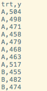

```{r setup, include=FALSE}
knitr::opts_chunk$set(echo = TRUE)
```

# Overview

This tutorial is not meant to be comprehensive, but instead show the near minimal amount to read in basic data into SAS. SAS documentation is actually quite complete, but as a beginner it can be hard to find exactly what you need. I will also point you to useful resources here.

If the dataset is small enough, you have the option of reading in data manually, otherwise you can read the data from a file.

# SAS Code

The `gluedata.csv` file we use in this example looks like this:


<center>  </center>

The following shows manual data entry and file input into SAS.


<script src="https://gist.github.com/lioumens/9ae1c1ef6178311a90e60710a5bfca91.js"></script>

* `data glue;`
    - Specifies the data step, and the dataset name to be glue
* `input trt $ y @@;` 
    - `trt $` should be read together. `$` specifies that the previous variable is a character type. 
    - `y` is the name of the next field.
    - The double `@@` symbol indicates, after reading trt and y on this line, continue reading trt and y on the same line instead of going onto the next line.
* `datalines`
    - Specifies that the lines below are the data
* `infile "~/sasuser.v94/gluedata.csv" dlm="," firstobs=2;`
    - `"~/sasuser.v94/gluedata.csv"` specifies the location of the file. If this is confusing, see the "filepath" [section of reading data into R](reading_in_data.html#file_paths)
    - `dlm=","` specifies that the delimiter between the values is a comma.
    - `firstobs=2` says to ignore the first line of the file, which is the header row.
  
  
# Further Reading

* [Common Options for Infile](https://stats.idre.ucla.edu/sas/faq/what-are-some-common-options-for-the-infile-statement-in-sas/)
* [Official Documentation for INFILE](http://documentation.sas.com/?activeCdc=pgmsascdc&cdcId=sasstudiocdc&cdcVersion=3.7&docsetId=lestmtsref&docsetTarget=n1rill4udj0tfun1fvce3j401plo.htm&locale=en#)
* [Official Documentation for INPUT](http://documentation.sas.com/?activeCdc=pgmsascdc&cdcId=sasstudiocdc&cdcVersion=3.7&docsetId=lestmtsref&docsetTarget=n0oaql83drile0n141pdacojq97s.htm&locale=en&docsetVersion=9.4)